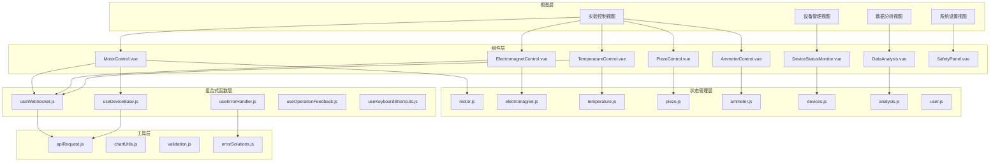

# 前端架构

> **文档版本**: v1.0.0  
> **最后更新**: 2026-03-15  
> **作者**: CAUC-SEP 技术团队

## 1. 架构概述

前端采用 **Vue 3 + Composition API** 架构，结合 Pinia 状态管理和 TypeScript 类型安全，构建响应式的实验控制界面。



---

## 2. 视图层

视图层负责页面级别的布局和路由管理。

### 2.1 目录结构

```
frontend/src/views/
├── analysis/              # 数据分析视图
│   ├── Charts.vue         # 图表分析
│   ├── History.vue        # 历史数据
│   └── Realtime.vue       # 实时分析
├── device/                # 设备管理视图
│   ├── Connection.vue     # 连接配置
│   ├── PRPath.vue         # P-R路径
│   └── Status.vue         # 设备状态
├── experiment/            # 实验控制视图
│   ├── AmmeterControl.vue     # 皮安表控制
│   ├── ElectromagnetControl.vue # 电磁铁控制
│   ├── MotorControl.vue       # 电机控制
│   ├── PiezoControl.vue       # 压电控制
│   ├── SafetyPanel.vue        # 安全面板
│   └── TemperatureControl.vue # 温度控制
├── settings/              # 系统设置视图
│   ├── About.vue          # 关于页面
│   ├── Audit.vue          # 审计日志
│   ├── Config.vue         # 配置管理
│   ├── Performance.vue    # 性能监控
│   ├── Profile.vue        # 用户配置
│   └── UserManagement.vue # 用户管理
├── test/                  # 测试视图
│   ├── OperationFeedbackTest.vue
│   └── TestLayout.vue
├── Layout.vue             # 主布局
├── LayoutIDE.vue          # IDE布局
├── Login.vue              # 登录页面
└── NotFound.vue           # 404页面
```

### 2.2 视图说明

| 视图 | 路由 | 功能说明 |
|------|------|----------|
| `MotorControl.vue` | `/experiment/motor` | 电机控制面板：绝对定位、相对定位、JOG、回零 |
| `ElectromagnetControl.vue` | `/experiment/electromagnet` | 电磁铁控制面板：磁场设置、扫描、校准 |
| `TemperatureControl.vue` | `/experiment/temperature` | 温度控制面板：温度设置、程序升温 |
| `PiezoControl.vue` | `/experiment/piezo` | 压电陶瓷控制面板：电压设置、校准 |
| `AmmeterControl.vue` | `/experiment/ammeter` | 皮安表控制面板：电流测量、通道配置 |
| `DataAnalysis.vue` | `/analysis` | 数据分析面板：MR 曲线、拟合计算 |
| `Status.vue` | `/device/status` | 设备状态监控：连接状态、实时数据 |
| `Connection.vue` | `/device/connection` | 设备连接配置：串口、GPIB、USB |

---

## 3. 组件层

组件层实现可复用的 UI 组件，采用原子设计模式。

### 3.1 目录结构

```
frontend/src/components/
├── analysis/              # 分析组件
│   ├── ChartAnalysis.vue      # 图表分析
│   ├── ChartToolbar.vue       # 图表工具栏
│   ├── DataAnalysis.vue       # 数据分析
│   ├── HistoryQuery.vue       # 历史查询
│   ├── RealtimeAnalysis.vue   # 实时分析
│   └── index.js
├── common/                # 通用组件
│   ├── ErrorDisplay.vue       # 错误显示
│   ├── ErrorSolution.vue      # 错误解决方案
│   ├── GlobalLoading.vue      # 全局加载
│   ├── OperationFeedback.vue  # 操作反馈
│   ├── OperationProgress.vue  # 操作进度
│   ├── PageSkeleton.vue       # 页面骨架
│   ├── RouteLoading.vue       # 路由加载
│   ├── ShortcutHelp.vue       # 快捷键帮助
│   ├── UpdateNotification.vue # 更新通知
│   ├── UserGuide.vue          # 用户指南
│   ├── VirtualList.vue        # 虚拟列表
│   ├── VirtualScrollList.vue  # 虚拟滚动列表
│   ├── WebSocketStatusIndicator.vue # WebSocket状态
│   └── index.js
├── device/                # 设备组件
│   ├── ConnectionConfig.vue   # 连接配置
│   ├── ConnectionPanel.vue    # 连接面板
│   ├── DeviceStatusDashboard.vue # 设备状态仪表盘
│   ├── DeviceStatusMonitor.vue # 设备状态监控
│   ├── IOConfig.vue           # IO配置
│   ├── PRPathConfig.vue       # P-R路径配置
│   ├── PRPathEditor.vue       # P-R路径编辑器
│   ├── PositionChart.vue      # 位置图表
│   ├── PositionDisplay.vue    # 位置显示
│   └── index.js
├── experiment/            # 实验组件
│   ├── ammeter/               # 皮安表组件
│   │   ├── AmmeterChannelConfig.vue
│   │   ├── AmmeterControl.vue
│   │   ├── AmmeterDisplay.vue
│   │   ├── AmmeterWaveform.vue
│   │   └── index.js
│   ├── electromagnet/         # 电磁铁组件
│   │   ├── ElectromagnetControl.vue
│   │   ├── ElectromagnetFieldMap.vue
│   │   ├── ElectromagnetScanConfig.vue
│   │   └── index.js
│   ├── motor/                 # 电机组件
│   │   ├── MotorControl.vue
│   │   ├── MotorHistoryPanel.vue
│   │   ├── MotorPositionPreset.vue
│   │   ├── MotorTrajectoryPreview.vue
│   │   └── index.js
│   ├── piezo/                 # 压电组件
│   │   ├── PiezoCalibrationEditor.vue
│   │   ├── PiezoControl.vue
│   │   ├── PiezoVoltageMap.vue
│   │   └── index.js
│   ├── temperature/           # 温度组件
│   │   ├── TemperatureControl.vue
│   │   ├── TemperatureCurve.vue
│   │   ├── TemperatureProgram.vue
│   │   └── index.js
│   ├── ExperimentPanel.vue    # 实验面板
│   ├── SafetyPanel.vue        # 安全面板
│   └── index.js
├── layout/                # 布局组件
│   ├── Sidebar.vue            # 侧边栏
│   ├── SidebarIDE.vue         # IDE侧边栏
│   ├── StatusBar.vue          # 状态栏
│   ├── StatusBarIDE.vue       # IDE状态栏
│   ├── Topbar.vue             # 顶部栏
│   ├── TopbarIDE.vue          # IDE顶部栏
│   └── index.js
├── settings/              # 设置组件
│   ├── AuditLog.vue           # 审计日志
│   ├── AuditLogFilter.vue     # 审计日志过滤
│   ├── AuditLogStats.vue      # 审计日志统计
│   ├── ConfigEditor.vue       # 配置编辑器
│   ├── ConfigHistory.vue      # 配置历史
│   └── index.js
└── index.js
```

### 3.2 组件设计规范

#### 3.2.1 组件命名

| 类型 | 命名规范 | 示例 |
|------|----------|------|
| 页面组件 | PascalCase | `MotorControl.vue` |
| 基础组件 | Base前缀 | `BaseButton.vue` |
| 业务组件 | 语义化命名 | `DeviceStatusMonitor.vue` |
| 高阶组件 | With前缀 | `WithLoading.vue` |

#### 3.2.2 组件结构

```vue
<!-- 组件模板结构示例 -->
<template>
  <div class="motor-control">
    <!-- 顶部操作栏 -->
    <header class="control-header">
      <h2>{{ title }}</h2>
      <div class="actions">
        <el-button @click="handleEmergencyStop" type="danger">
          急停
        </el-button>
      </div>
    </header>

    <!-- 主内容区 -->
    <main class="control-content">
      <!-- 位置显示 -->
      <PositionDisplay :position="currentPosition" />
      
      <!-- 控制面板 -->
      <div class="control-panels">
        <MotorPositionPreset @select="handlePresetSelect" />
        <MotorTrajectoryPreview :trajectory="trajectory" />
      </div>
    </main>
  </div>
</template>

<script setup lang="ts">
/**
 * @file MotorControl.vue
 * @description 电机控制组件，提供绝对定位、相对定位、JOG等功能
 */

import { ref, computed, onMounted, onUnmounted } from 'vue';
import { useMotorStore } from '@/stores/motor';
import { useWebSocket } from '@/composables/useWebSocket';

// Props定义
interface Props {
  deviceId: string;
  readonly?: boolean;
}

const props = withDefaults(defineProps<Props>(), {
  readonly: false,
});

// Emits定义
const emit = defineEmits<{
  (e: 'positionChange', position: number): void;
  (e: 'error', message: string): void;
}>();

// 状态管理
const motorStore = useMotorStore();
const { subscribe, unsubscribe } = useWebSocket();

// 响应式状态
const currentPosition = ref(0);
const isMoving = ref(false);

// 计算属性
const title = computed(() => `电机控制 - ${props.deviceId}`);

// 方法
async function handleEmergencyStop(): Promise<void> {
  await motorStore.emergencyStop(props.deviceId);
}

// 生命周期
onMounted(() => {
  subscribe(`motor:${props.deviceId}`, handlePositionUpdate);
});

onUnmounted(() => {
  unsubscribe(`motor:${props.deviceId}`);
});
</script>

<style scoped lang="scss">
.motor-control {
  display: flex;
  flex-direction: column;
  height: 100%;
  
  .control-header {
    display: flex;
    justify-content: space-between;
    padding: 16px;
    border-bottom: 1px solid var(--color-border);
  }
  
  .control-content {
    flex: 1;
    padding: 16px;
    overflow: auto;
  }
}
</style>
```

---

## 4. 状态管理层

状态管理层使用 Pinia 实现集中式状态管理。

### 4.1 目录结构

```
frontend/src/stores/
├── README.md
├── index.js               # Store入口
├── ammeter.js             # 皮安表状态
├── analysis.js            # 分析状态
├── audit.js               # 审计状态
├── devices.js             # 设备状态
├── electromagnet.js       # 电磁铁状态
├── experiment.js          # 实验状态
├── layout.js              # 布局状态
├── motor.js               # 电机状态
├── operation.js           # 操作状态
├── piezo.js               # 压电状态
├── settings.js            # 设置状态
├── temperature.js         # 温度状态
├── update.js              # 更新状态
└── user.js                # 用户状态
```

### 4.2 Store 设计规范

```javascript
/**
 * @file motor.js
 * @description 电机状态管理
 */

import { defineStore } from 'pinia';
import { ref, computed } from 'vue';
import { motorApi } from '@/api/motor';

export const useMotorStore = defineStore('motor', () => {
  // 状态
  const devices = ref({});
  const currentDevice = ref(null);
  const isLoading = ref(false);
  const error = ref(null);

  // 计算属性
  const deviceList = computed(() => Object.values(devices.value));
  
  const isConnected = computed(() => {
    return currentDevice.value?.status === 'ready';
  });

  // Actions
  /**
   * 连接设备
   * @param {string} deviceId - 设备ID
   * @param {object} config - 连接配置
   */
  async function connectDevice(deviceId, config) {
    isLoading.value = true;
    error.value = null;
    
    try {
      const result = await motorApi.connect(deviceId, config);
      devices.value[deviceId] = result;
      currentDevice.value = result;
      return true;
    } catch (err) {
      error.value = err.message;
      return false;
    } finally {
      isLoading.value = false;
    }
  }

  /**
   * 绝对定位
   * @param {string} deviceId - 设备ID
   * @param {number} position - 目标位置
   * @param {object} params - 运动参数
   */
  async function moveAbs(deviceId, position, params = {}) {
    const device = devices.value[deviceId];
    if (!device) {
      throw new Error(`设备 ${deviceId} 未找到`);
    }
    
    isLoading.value = true;
    
    try {
      await motorApi.moveAbs(deviceId, {
        position,
        speed: params.speed || 10.0,
        accel: params.accel || 100.0,
        decel: params.decel || 100.0,
      });
      
      device.position = position;
      return true;
    } catch (err) {
      error.value = err.message;
      throw err;
    } finally {
      isLoading.value = false;
    }
  }

  /**
   * 急停
   * @param {string} deviceId - 设备ID
   */
  async function emergencyStop(deviceId) {
    try {
      await motorApi.emergencyStop(deviceId);
      const device = devices.value[deviceId];
      if (device) {
        device.status = 'emergency_stop';
      }
    } catch (err) {
      error.value = err.message;
      throw err;
    }
  }

  /**
   * 更新设备状态（WebSocket回调）
   * @param {string} deviceId - 设备ID
   * @param {object} data - 状态数据
   */
  function updateDeviceStatus(deviceId, data) {
    const device = devices.value[deviceId];
    if (device) {
      Object.assign(device, data);
    }
  }

  return {
    // 状态
    devices,
    currentDevice,
    isLoading,
    error,
    
    // 计算属性
    deviceList,
    isConnected,
    
    // Actions
    connectDevice,
    moveAbs,
    emergencyStop,
    updateDeviceStatus,
  };
});
```

### 4.3 Store 说明

| Store | 功能说明 | 主要状态 |
|-------|----------|----------|
| `motor.js` | 电机状态管理 | 设备列表、当前位置、运动状态 |
| `electromagnet.js` | 电磁铁状态管理 | 磁场强度、扫描状态、校准数据 |
| `temperature.js` | 温度状态管理 | 当前温度、目标温度、程序升温 |
| `piezo.js` | 压电状态管理 | 电压值、校准曲线、扫描状态 |
| `ammeter.js` | 皮安表状态管理 | 电流值、通道配置、测量模式 |
| `devices.js` | 设备统一管理 | 连接状态、设备注册表 |
| `analysis.js` | 数据分析状态 | MR曲线、拟合参数、图表数据 |
| `user.js` | 用户状态管理 | 登录状态、用户信息、权限 |

---

## 5. 组合式函数层

组合式函数层提供可复用的逻辑封装。

### 5.1 目录结构

```
frontend/src/composables/
├── README.md
├── index.js                    # 导出入口
├── useDataAnimation.js         # 数据动画
├── useDataAnomaly.js           # 数据异常检测
├── useDataFreshness.js         # 数据新鲜度
├── useDeviceBase.js            # 设备基础功能
├── useErrorHandler.js          # 错误处理
├── useHistoryQuery.js          # 历史查询
├── useKeyboardShortcuts.js     # 键盘快捷键
├── useLoading.js               # 加载状态
├── useOffline.js               # 离线处理
├── useOnlineStatus.js          # 在线状态
├── useOperationFeedback.js     # 操作反馈
├── useOperationHistory.js      # 操作历史
├── useProgress.js              # 进度管理
├── usePushFrequency.js         # 推送频率
├── useUserPreferences.js       # 用户偏好
├── useWebSocket.js             # WebSocket连接
├── useWebSocketIntegration.js  # WebSocket集成
├── useWebSocketOptimization.js # WebSocket优化
└── useWebSocketReconnect.js    # WebSocket重连
```

### 5.2 组合式函数设计

#### 5.2.1 WebSocket 连接

```javascript
/**
 * @file useWebSocket.js
 * @description WebSocket连接管理
 */

import { ref, onMounted, onUnmounted } from 'vue';
import { useWebSocketStore } from '@/stores/websocket';

export function useWebSocket() {
  const store = useWebSocketStore();
  const isConnected = ref(false);
  const error = ref(null);
  
  let socket = null;
  const subscriptions = new Map();

  /**
   * 建立连接
   */
  function connect(url) {
    if (socket?.readyState === WebSocket.OPEN) {
      return;
    }

    socket = new WebSocket(url);

    socket.onopen = () => {
      isConnected.value = true;
      error.value = null;
      
      // 重新订阅
      subscriptions.forEach((callback, topic) => {
        socket.send(JSON.stringify({ type: 'subscribe', topic }));
      });
    };

    socket.onmessage = (event) => {
      const data = JSON.parse(event.data);
      const callback = subscriptions.get(data.topic);
      if (callback) {
        callback(data.payload);
      }
    };

    socket.onerror = (err) => {
      error.value = 'WebSocket连接错误';
      console.error('WebSocket error:', err);
    };

    socket.onclose = () => {
      isConnected.value = false;
    };
  }

  /**
   * 订阅主题
   */
  function subscribe(topic, callback) {
    subscriptions.set(topic, callback);
    
    if (socket?.readyState === WebSocket.OPEN) {
      socket.send(JSON.stringify({ type: 'subscribe', topic }));
    }
  }

  /**
   * 取消订阅
   */
  function unsubscribe(topic) {
    subscriptions.delete(topic);
    
    if (socket?.readyState === WebSocket.OPEN) {
      socket.send(JSON.stringify({ type: 'unsubscribe', topic }));
    }
  }

  /**
   * 断开连接
   */
  function disconnect() {
    if (socket) {
      socket.close();
      socket = null;
    }
    subscriptions.clear();
  }

  // 生命周期
  onUnmounted(() => {
    disconnect();
  });

  return {
    isConnected,
    error,
    connect,
    subscribe,
    unsubscribe,
    disconnect,
  };
}
```

#### 5.2.2 设备基础功能

```javascript
/**
 * @file useDeviceBase.js
 * @description 设备基础功能封装
 */

import { ref, computed } from 'vue';
import { useErrorHandler } from './useErrorHandler';
import { useOperationFeedback } from './useOperationFeedback';

export function useDeviceBase(deviceType, deviceId) {
  const { handleError } = useErrorHandler();
  const { showSuccess, showError, showLoading } = useOperationFeedback();

  const status = ref('disconnected');
  const isLoading = ref(false);
  const lastError = ref(null);

  const isConnected = computed(() => status.value === 'ready');
  const isBusy = computed(() => status.value === 'busy');
  const isError = computed(() => status.value === 'error');

  /**
   * 执行设备操作
   */
  async function executeOperation(operation, options = {}) {
    const { 
      successMessage = '操作成功',
      errorMessage = '操作失败',
      showFeedback = true 
    } = options;

    if (showFeedback) {
      showLoading('正在执行操作...');
    }

    isLoading.value = true;
    lastError.value = null;

    try {
      const result = await operation();
      
      if (showFeedback) {
        showSuccess(successMessage);
      }
      
      return result;
    } catch (error) {
      lastError.value = error.message;
      handleError(error, { context: `${deviceType}:${deviceId}` });
      
      if (showFeedback) {
        showError(errorMessage);
      }
      
      throw error;
    } finally {
      isLoading.value = false;
    }
  }

  return {
    status,
    isLoading,
    lastError,
    isConnected,
    isBusy,
    isError,
    executeOperation,
  };
}
```

#### 5.2.3 错误处理

```javascript
/**
 * @file useErrorHandler.js
 * @description 统一错误处理
 */

import { ref } from 'vue';
import { errorSolutions } from '@/utils/errorSolutions';

export function useErrorHandler() {
  const lastError = ref(null);
  const solutions = ref([]);

  /**
   * 处理错误
   */
  function handleError(error, options = {}) {
    const { context = '', silent = false } = options;

    lastError.value = {
      message: error.message,
      code: error.code || 'UNKNOWN_ERROR',
      context,
      timestamp: new Date().toISOString(),
    };

    // 查找解决方案
    solutions.value = errorSolutions[error.code] || [];

    // 记录日志
    console.error(`[${context}] Error:`, error);

    if (!silent) {
      // 可以触发全局错误提示
      // 例如：ElMessage.error(error.message)
    }
  }

  /**
   * 清除错误
   */
  function clearError() {
    lastError.value = null;
    solutions.value = [];
  }

  return {
    lastError,
    solutions,
    handleError,
    clearError,
  };
}
```

---

## 6. 工具层

工具层提供通用工具函数和常量定义。

### 6.1 目录结构

```
frontend/src/utils/
├── apiRequest.js            # API请求封装
├── chartUtils.js            # 图表工具
├── dataThrottle.js          # 数据节流
├── errorHandlerIntegration.js # 错误处理集成
├── errorSolutions.js        # 错误解决方案
├── healthCheck.js           # 健康检查
├── offlineQueue.js          # 离线队列
├── offlineStorage.js        # 离线存储
├── offlineSync.js           # 离线同步
├── tokenAuth.js             # Token认证
└── validation.js            # 数据验证
```

### 6.2 API 请求封装

```javascript
/**
 * @file apiRequest.js
 * @description API请求封装
 */

import axios from 'axios';
import { ElMessage } from 'element-plus';

const api = axios.create({
  baseURL: '/api/v1',
  timeout: 30000,
  headers: {
    'Content-Type': 'application/json',
  },
});

// 请求拦截器
api.interceptors.request.use(
  (config) => {
    // 添加Token
    const token = localStorage.getItem('token');
    if (token) {
      config.headers.Authorization = `Bearer ${token}`;
    }
    return config;
  },
  (error) => {
    return Promise.reject(error);
  }
);

// 响应拦截器
api.interceptors.response.use(
  (response) => {
    return response.data;
  },
  (error) => {
    const { response } = error;
    
    if (response) {
      switch (response.status) {
        case 401:
          ElMessage.error('未授权，请重新登录');
          // 跳转登录页
          break;
        case 403:
          ElMessage.error('权限不足');
          break;
        case 404:
          ElMessage.error('资源不存在');
          break;
        case 429:
          ElMessage.error('请求过于频繁，请稍后再试');
          break;
        case 500:
          ElMessage.error('服务器错误');
          break;
        default:
          ElMessage.error(response.data?.message || '请求失败');
      }
    } else {
      ElMessage.error('网络错误，请检查网络连接');
    }
    
    return Promise.reject(error);
  }
);

export default api;
```

### 6.3 图表工具

```javascript
/**
 * @file chartUtils.js
 * @description 图表配置工具
 */

export const chartColors = {
  primary: '#409EFF',
  success: '#67C23A',
  warning: '#E6A23C',
  danger: '#F56C6C',
  info: '#909399',
};

/**
 * 生成MR曲线配置
 */
export function generateMRCurveOption(data) {
  return {
    title: {
      text: 'MR曲线',
      left: 'center',
    },
    tooltip: {
      trigger: 'axis',
      formatter: (params) => {
        const point = params[0];
        return `磁场: ${point.value[0]} mT<br/>MR: ${point.value[1]}%`;
      },
    },
    xAxis: {
      type: 'value',
      name: '磁场 (mT)',
      nameLocation: 'middle',
      nameGap: 30,
    },
    yAxis: {
      type: 'value',
      name: 'MR (%)',
      nameLocation: 'middle',
      nameGap: 40,
    },
    series: [
      {
        type: 'line',
        data: data,
        smooth: true,
        lineStyle: {
          color: chartColors.primary,
          width: 2,
        },
        areaStyle: {
          color: {
            type: 'linear',
            x: 0,
            y: 0,
            x2: 0,
            y2: 1,
            colorStops: [
              { offset: 0, color: 'rgba(64, 158, 255, 0.3)' },
              { offset: 1, color: 'rgba(64, 158, 255, 0.05)' },
            ],
          },
        },
      },
    ],
  };
}
```

---

## 7. 路由配置

### 7.1 路由结构

```javascript
/**
 * @file router/index.js
 * @description 路由配置
 */

import { createRouter, createWebHistory } from 'vue-router';
import { lazy } from './lazy';

const routes = [
  {
    path: '/',
    component: () => import('@/views/Layout.vue'),
    redirect: '/experiment/motor',
    children: [
      // 实验控制
      {
        path: 'experiment',
        children: [
          { path: 'motor', component: lazy('experiment/MotorControl') },
          { path: 'electromagnet', component: lazy('experiment/ElectromagnetControl') },
          { path: 'temperature', component: lazy('experiment/TemperatureControl') },
          { path: 'piezo', component: lazy('experiment/PiezoControl') },
          { path: 'ammeter', component: lazy('experiment/AmmeterControl') },
        ],
      },
      // 设备管理
      {
        path: 'device',
        children: [
          { path: 'status', component: lazy('device/Status') },
          { path: 'connection', component: lazy('device/Connection') },
          { path: 'pr-path', component: lazy('device/PRPath') },
        ],
      },
      // 数据分析
      {
        path: 'analysis',
        children: [
          { path: '', redirect: 'realtime' },
          { path: 'realtime', component: lazy('analysis/Realtime') },
          { path: 'history', component: lazy('analysis/History') },
          { path: 'charts', component: lazy('analysis/Charts') },
        ],
      },
      // 系统设置
      {
        path: 'settings',
        children: [
          { path: 'profile', component: lazy('settings/Profile') },
          { path: 'config', component: lazy('settings/Config') },
          { path: 'audit', component: lazy('settings/Audit') },
          { path: 'performance', component: lazy('settings/Performance') },
          { path: 'users', component: lazy('settings/UserManagement') },
          { path: 'about', component: lazy('settings/About') },
        ],
      },
    ],
  },
  { path: '/login', component: lazy('Login') },
  { path: '/:pathMatch(.*)*', component: lazy('NotFound') },
];

const router = createRouter({
  history: createWebHistory(),
  routes,
});

export default router;
```

---

## 8. 样式架构

### 8.1 目录结构

```
frontend/src/styles/
├── _components-enhanced.scss  # 组件增强样式
├── animations.scss            # 动画样式
├── data-animation.css         # 数据动画
├── design-system.css          # 设计系统
├── design-tokens.css          # 设计令牌
├── global.css                 # 全局样式
├── layout.css                 # 布局样式
├── page-layout.scss           # 页面布局
└── variables.scss             # 变量定义
```

### 8.2 设计令牌

```css
/* design-tokens.css */
:root {
  /* 颜色 */
  --color-primary: #409EFF;
  --color-success: #67C23A;
  --color-warning: #E6A23C;
  --color-danger: #F56C6C;
  --color-info: #909399;
  
  /* 背景 */
  --color-bg-primary: #FFFFFF;
  --color-bg-secondary: #F5F7FA;
  --color-bg-tertiary: #E4E7ED;
  
  /* 边框 */
  --color-border: #DCDFE6;
  --color-border-light: #E4E7ED;
  
  /* 文字 */
  --color-text-primary: #303133;
  --color-text-regular: #606266;
  --color-text-secondary: #909399;
  --color-text-placeholder: #C0C4CC;
  
  /* 间距 */
  --spacing-xs: 4px;
  --spacing-sm: 8px;
  --spacing-md: 16px;
  --spacing-lg: 24px;
  --spacing-xl: 32px;
  
  /* 圆角 */
  --radius-sm: 4px;
  --radius-md: 8px;
  --radius-lg: 12px;
  
  /* 阴影 */
  --shadow-sm: 0 2px 4px rgba(0, 0, 0, 0.05);
  --shadow-md: 0 4px 8px rgba(0, 0, 0, 0.1);
  --shadow-lg: 0 8px 16px rgba(0, 0, 0, 0.15);
  
  /* 过渡 */
  --transition-fast: 0.15s ease;
  --transition-normal: 0.3s ease;
  --transition-slow: 0.5s ease;
}
```

---

## 9. 相关文档

- [整体架构设计](./整体架构设计.md)
- [后端架构](./后端架构.md)
- [数据流设计](./数据流设计.md)
- [组件库文档](../06-前端组件/)
