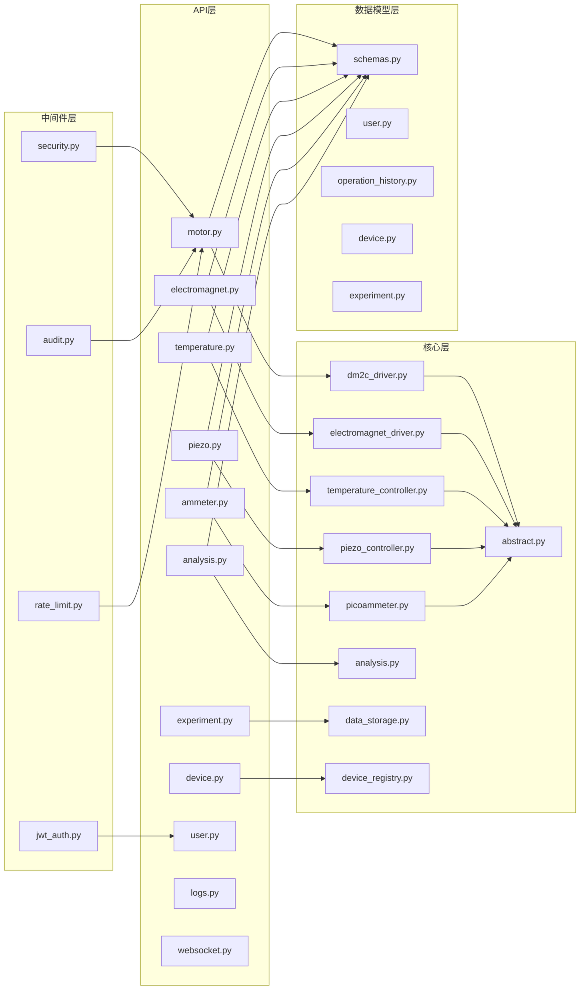
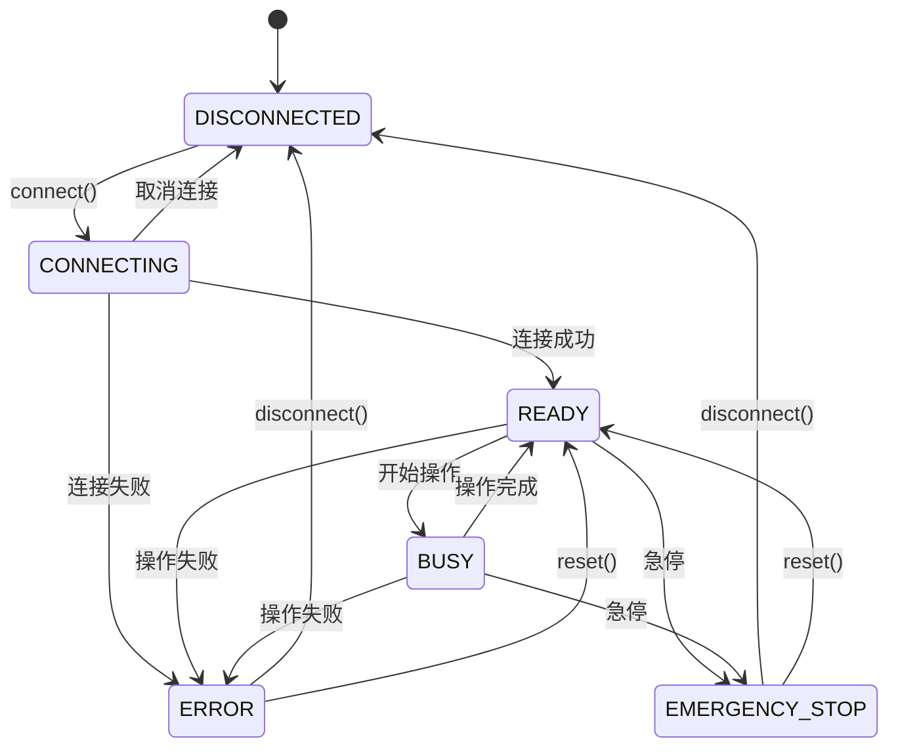
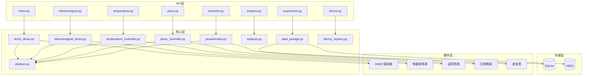

# 后端架构

> **文档版本**: v1.0.0  
> **最后更新**: 2026-03-15  
> **作者**: CAUC-SEP 技术团队

## 1. 架构概述

后端采用**分层架构**设计，从上到下分为 API 层、核心层、中间件层和数据模型层。各层职责明确，通过依赖注入实现松耦合。



---

## 2. API 层

API 层负责处理 HTTP 请求和 WebSocket 连接，是前后端通信的入口。

### 2.1 目录结构

```
backend/api/
├── __init__.py
├── ammeter.py           # 皮安表API
├── analysis.py          # 数据分析API
├── cache_api.py         # 缓存管理API
├── crash_report.py      # 崩溃报告API
├── device.py            # 设备管理API
├── electromagnet.py     # 电磁铁API
├── experiment.py        # 实验管理API
├── health.py            # 健康检查API
├── logs.py              # 日志查询API
├── motor.py             # 电机控制API
├── performance.py       # 性能监控API
├── piezo.py             # 压电陶瓷API
├── schemas.py           # 通用响应模型
├── temperature.py       # 温度控制API
├── tracing.py           # 链路追踪API
├── update.py            # 更新管理API
├── user.py              # 用户管理API
└── websocket.py         # WebSocket处理
```

### 2.2 API 模块说明

| 模块 | 路由前缀 | 功能说明 |
|------|----------|----------|
| `motor.py` | `/api/v1/motor` | 电机控制：绝对定位、相对定位、JOG、回零 |
| `electromagnet.py` | `/api/v1/electromagnet` | 电磁铁控制：磁场设置、扫描、校准 |
| `temperature.py` | `/api/v1/temperature` | 温度控制：温度设置、程序升温、PID 调节 |
| `piezo.py` | `/api/v1/piezo` | 压电陶瓷控制：电压设置、校准、扫描 |
| `ammeter.py` | `/api/v1/ammeter` | 皮安表控制：电流测量、通道配置 |
| `analysis.py` | `/api/v1/analysis` | 数据分析：MR 曲线、拟合计算 |
| `device.py` | `/api/v1/device` | 设备管理：连接、断开、状态查询 |
| `experiment.py` | `/api/v1/experiment` | 实验管理：创建、保存、导出 |
| `user.py` | `/api/v1/user` | 用户管理：登录、权限、配置 |
| `logs.py` | `/api/v1/logs` | 日志查询：操作日志、审计日志 |
| `websocket.py` | `/ws` | WebSocket：实时数据推送 |

### 2.3 API 设计规范

#### 响应格式

```python
# 成功响应
{
    "success": true,
    "data": { ... },
    "message": "操作成功"
}

# 错误响应
{
    "success": false,
    "error": {
        "code": "DEVICE_NOT_CONNECTED",
        "message": "设备未连接",
        "details": { ... }
    }
}
```

#### 状态码规范

| 状态码 | 说明 | 使用场景 |
|--------|------|----------|
| 200 | 成功 | 请求处理成功 |
| 201 | 已创建 | 资源创建成功 |
| 400 | 请求错误 | 参数验证失败 |
| 401 | 未授权 | 需要登录 |
| 403 | 禁止访问 | 权限不足 |
| 404 | 未找到 | 资源不存在 |
| 429 | 请求过多 | 触发速率限制 |
| 500 | 服务器错误 | 内部错误 |

---

## 3. 核心层

核心层包含业务逻辑和设备驱动，是系统的核心实现。

### 3.1 目录结构

```
backend/core/
├── __init__.py
├── abstract.py              # 硬件抽象基类
├── analysis.py              # 物理分析引擎
├── dm2c_driver.py           # DM2C电机驱动
├── electromagnet_driver.py  # 电磁铁驱动
├── error_recovery.py        # 错误恢复机制
├── picoammeter.py           # 皮安表驱动
├── piezo_controller.py      # 压电陶瓷控制器
├── startup_config.py        # 启动配置
├── static_files.py          # 静态文件服务
├── temperature_controller.py # 温度控制器
├── cache/                   # 缓存模块
│   ├── cache.py
│   ├── cache_strategy.py
│   └── local_cache.py
├── device_management/       # 设备管理
│   ├── device_registry.py
│   ├── device_utils.py
│   ├── driver_manager.py
│   └── rt_scheduler.py
├── logging/                 # 日志模块
│   ├── crash_report.py
│   ├── crash_upload.py
│   └── logging_config.py
├── monitoring/              # 监控模块
│   ├── metrics.py
│   ├── profiler.py
│   ├── query_monitor.py
│   └── tracing.py
└── storage/                 # 存储模块
    ├── data_pipeline.py
    ├── data_storage.py
    ├── database.py
    ├── index_optimizer.py
    └── timeseries_storage.py
```

### 3.2 核心模块说明

#### 3.2.1 硬件抽象层 (HAL)

[abstract.py](../../../backend/core/abstract.py) 定义了所有硬件设备的统一抽象接口：

```python
class DeviceStatus(Enum):
    """设备状态枚举。"""
    DISCONNECTED = "disconnected"
    CONNECTING = "connecting"
    READY = "ready"
    BUSY = "busy"
    ERROR = "error"
    EMERGENCY_STOP = "emergency_stop"

class AbstractDevice(ABC):
    """硬件设备抽象基类。"""
    
    @abstractmethod
    async def connect(self) -> bool:
        """建立连接。"""
        pass
    
    @abstractmethod
    async def disconnect(self) -> bool:
        """断开连接。"""
        pass
    
    @abstractmethod
    async def read_status(self) -> dict:
        """读取状态。"""
        pass

class AbstractStepper(AbstractDevice):
    """步进电机抽象接口。"""
    
    @abstractmethod
    async def move_abs(self, position: float, speed: float, 
                       accel: float, decel: float) -> bool:
        """绝对位置定位。"""
        pass
```

**状态机设计**:



#### 3.2.2 设备注册表

[device_registry.py](../../../backend/core/device_management/device_registry.py) 管理所有设备实例：

```python
class DeviceRegistry:
    """设备注册表。"""
    
    def __init__(self):
        self._devices: dict[str, AbstractDevice] = {}
    
    def register(self, device_id: str, device: AbstractDevice) -> None:
        """注册设备。"""
        self._devices[device_id] = device
    
    def get(self, device_id: str) -> AbstractDevice | None:
        """获取设备。"""
        return self._devices.get(device_id)
    
    def list_all(self) -> list[dict]:
        """列出所有设备。"""
        return [
            device.get_status_info() 
            for device in self._devices.values()
        ]
```

#### 3.2.3 数据存储

[data_storage.py](../../../backend/core/storage/data_storage.py) 提供数据持久化服务：

```python
class DataStorage:
    """数据存储管理器。"""
    
    def __init__(self, db_path: str):
        self.db_path = db_path
        self._init_database()
    
    async def save_experiment(self, experiment: Experiment) -> int:
        """保存实验数据。"""
        pass
    
    async def load_experiment(self, exp_id: int) -> Experiment | None:
        """加载实验数据。"""
        pass
    
    async def query_experiments(self, filters: dict) -> list[Experiment]:
        """查询实验列表。"""
        pass
```

---

## 4. 中间件层

中间件层提供横切关注点的处理，包括安全、审计、速率限制等。

### 4.1 目录结构

```
backend/middleware/
├── __init__.py
├── audit.py          # 审计日志中间件
├── cors_config.py    # CORS配置
├── jwt_auth.py       # JWT认证中间件
├── rate_limit.py     # 速率限制中间件
├── security.py       # 安全中间件
└── validation.py     # 输入验证中间件
```

### 4.2 中间件说明

#### 4.2.1 安全中间件

[security.py](../../../backend/middleware/security.py) 提供多层安全防护：

```python
class RateLimitMiddleware(BaseHTTPMiddleware):
    """速率限制中间件。"""
    
    def __init__(self, app: ASGIApp, rate_limiter: RateLimiter | None = None):
        super().__init__(app)
        self.rate_limiter = rate_limiter or RateLimiter()
    
    async def dispatch(self, request: Request, call_next: Callable) -> Response:
        # 检查速率限制
        allowed, remaining, reset_time = self.rate_limiter.is_allowed(request)
        
        if not allowed:
            return Response(
                content='{"detail":"Too many requests"}',
                status_code=429,
                headers={"Retry-After": str(reset_time)}
            )
        
        response = await call_next(request)
        response.headers["X-RateLimit-Remaining"] = str(remaining)
        return response

class SecurityHeadersMiddleware(BaseHTTPMiddleware):
    """安全响应头中间件。"""
    
    async def dispatch(self, request: Request, call_next: Callable) -> Response:
        response = await call_next(request)
        
        # 添加安全头
        response.headers["X-Content-Type-Options"] = "nosniff"
        response.headers["X-Frame-Options"] = "DENY"
        response.headers["X-XSS-Protection"] = "1; mode=block"
        
        return response
```

**速率限制策略**:

| 路径类型 | 限制 | 说明 |
|----------|------|------|
| 默认 | 100次/分钟 | 全局默认限制 |
| 敏感操作 | 30次/分钟 | 急停、复位等 |
| 校准操作 | 10次/分钟 | 设备校准 |
| 数据导出 | 60次/分钟 | 批量数据导出 |

#### 4.2.2 审计中间件

[audit.py](../../../backend/middleware/audit.py) 记录所有操作日志：

```python
class AuditMiddleware(BaseHTTPMiddleware):
    """审计日志中间件。"""
    
    async def dispatch(self, request: Request, call_next: Callable) -> Response:
        # 记录请求
        start_time = time.time()
        
        response = await call_next(request)
        
        # 记录响应
        duration = time.time() - start_time
        
        await self._log_operation(
            request=request,
            response=response,
            duration=duration
        )
        
        return response
```

---

## 5. 数据模型层

数据模型层定义数据结构和验证规则。

### 5.1 目录结构

```
backend/models/
├── __init__.py
├── device.py             # 设备模型
├── experiment.py         # 实验模型
├── logs.py               # 日志模型
├── operation_history.py  # 操作历史模型
└── user.py               # 用户模型

backend/schemas/
├── __init__.py
├── ammeter.py            # 皮安表Schema
├── analysis.py           # 分析Schema
├── common.py             # 通用Schema
├── device.py             # 设备Schema
├── electromagnet.py      # 电磁铁Schema
├── experiment.py         # 实验Schema
├── motor.py              # 电机Schema
├── piezo.py              # 压电Schema
└── temperature.py        # 温度Schema
```

### 5.2 Schema 设计

使用 Pydantic 进行数据验证：

```python
from pydantic import BaseModel, Field
from typing import Optional
from datetime import datetime

class MotorMoveRequest(BaseModel):
    """电机移动请求。"""
    
    position: float = Field(..., ge=-100, le=100, description="目标位置(mm)")
    speed: float = Field(default=10.0, ge=0.1, le=100, description="速度(mm/s)")
    accel: float = Field(default=100.0, ge=10, le=1000, description="加速度(mm/s²)")
    decel: float = Field(default=100.0, ge=10, le=1000, description="减速度(mm/s²)")

class MotorStatusResponse(BaseModel):
    """电机状态响应。"""
    
    device_id: str
    status: str
    position_mm: float
    position_steps: int
    is_moving: bool
    last_error: Optional[str] = None
    timestamp: datetime
```

---

## 6. 模块依赖关系



---

## 7. 错误处理机制

### 7.1 错误类型

| 错误类型 | 说明 | 处理方式 |
|----------|------|----------|
| `DeviceError` | 设备操作错误 | 记录日志，返回错误响应 |
| `ConnectionError` | 连接错误 | 自动重试，状态更新 |
| `ValidationError` | 参数验证错误 | 返回 400 错误 |
| `StorageError` | 存储错误 | 回滚事务，记录日志 |

### 7.2 错误恢复

[error_recovery.py](../../../backend/core/error_recovery.py) 提供自动错误恢复：

```python
class ErrorRecovery:
    """错误恢复管理器。"""
    
    async def handle_device_error(self, device: AbstractDevice, error: Exception) -> bool:
        """处理设备错误。"""
        
        # 1. 记录错误
        logger.error(f"Device error: {device.device_id}", exc_info=error)
        
        # 2. 设置错误状态
        device.set_error(str(error))
        
        # 3. 尝试恢复
        if await self._can_recover(device, error):
            return await device.reset()
        
        return False
```

---

## 8. 性能优化

### 8.1 缓存策略

[cache.py](../../../backend/core/cache/cache.py) 实现多级缓存：

```python
class CacheManager:
    """缓存管理器。"""
    
    def __init__(self):
        self._memory_cache = {}
        self._cache_strategy = LRUStrategy(max_size=1000)
    
    async def get(self, key: str) -> Any | None:
        """获取缓存。"""
        return self._memory_cache.get(key)
    
    async def set(self, key: str, value: Any, ttl: int = 300) -> None:
        """设置缓存。"""
        self._memory_cache[key] = value
```

### 8.2 异步处理

所有 I/O 操作使用异步模式：

```python
# 异步设备操作
async def move_motor(device_id: str, position: float) -> dict:
    device = registry.get(device_id)
    if not device:
        raise DeviceNotFoundError(device_id)
    
    await device.move_abs(position, speed=10.0, accel=100.0, decel=100.0)
    return {"status": "success", "position": position}
```

---

## 9. 相关文档

- [整体架构设计](./整体架构设计.md)
- [前端架构](./前端架构.md)
- [数据流设计](./数据流设计.md)
- [API 参考](../05-API参考/)
