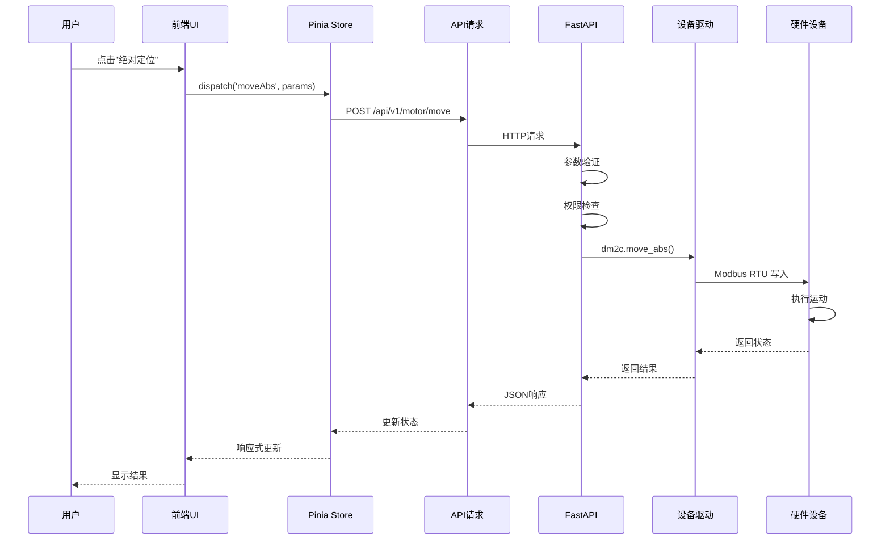
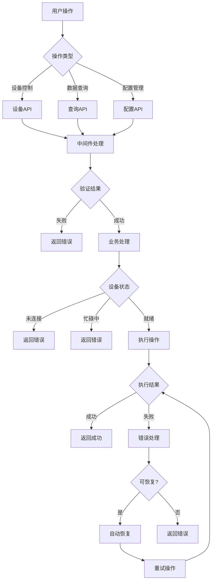
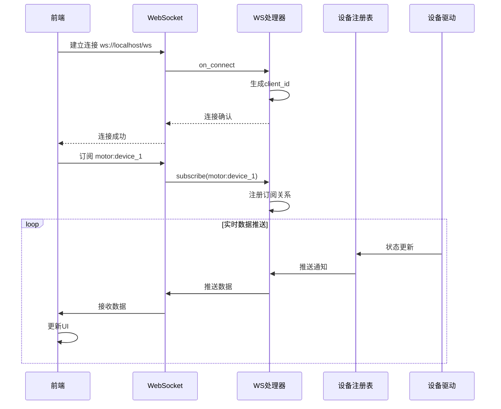
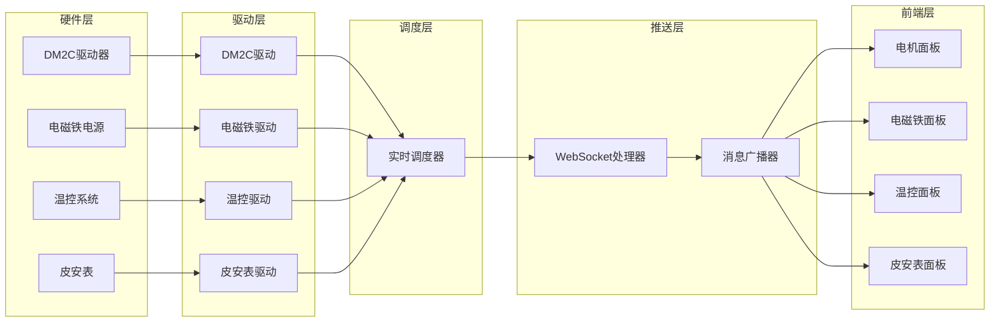
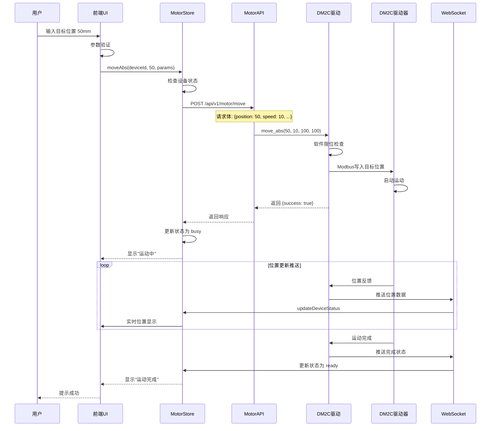
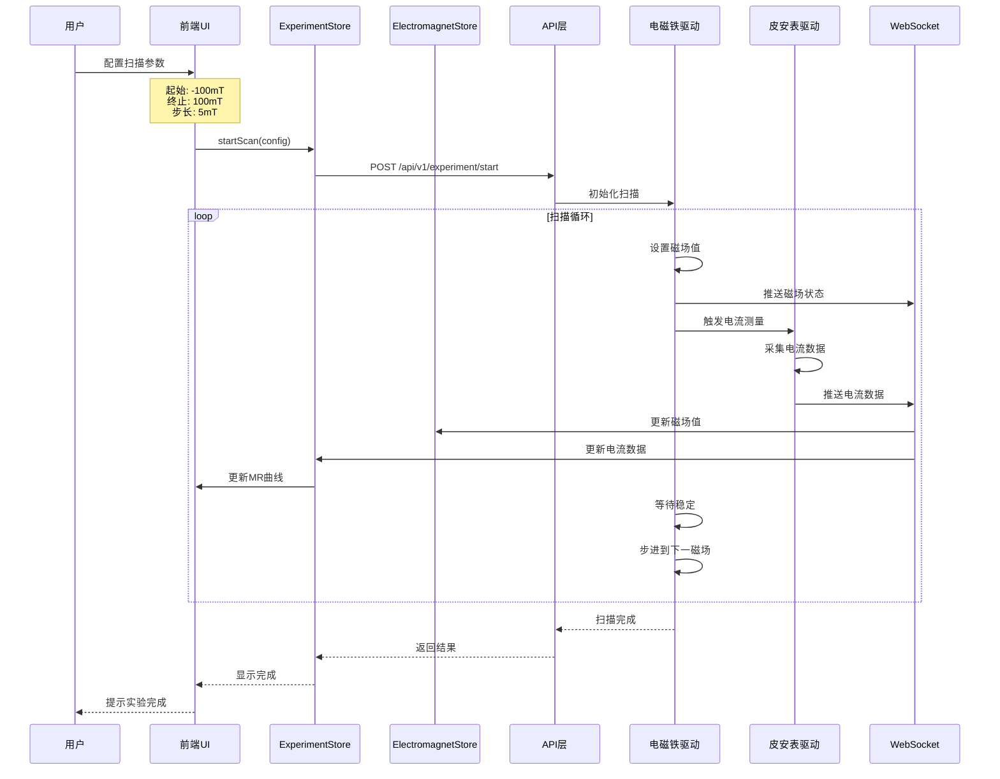
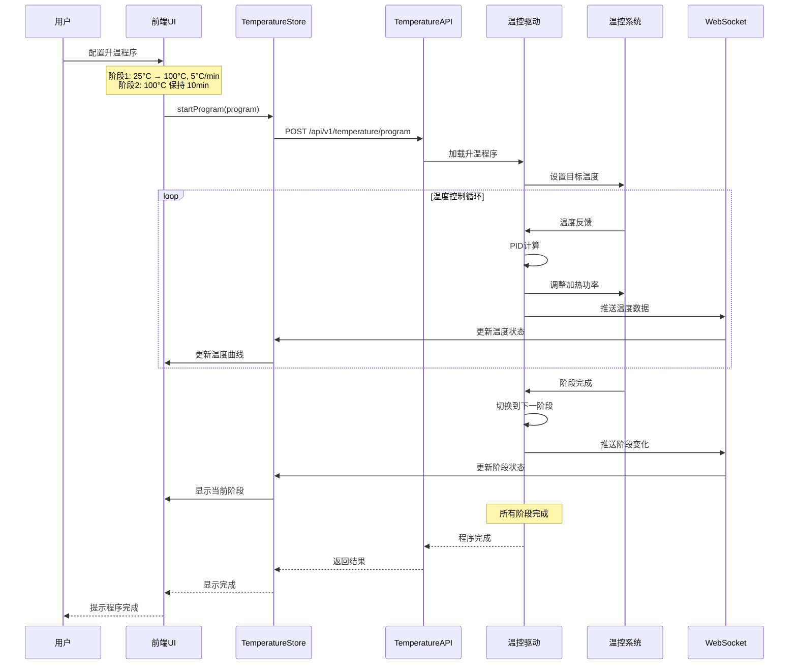

# 数据流设计

> **文档版本**: v1.0.0  
> **最后更新**: 2026-03-15  
> **作者**: CAUC-SEP 技术团队

## 1. 数据流概述

CAUC-SEP 系统采用**双向数据流**设计，支持同步请求和实时推送两种通信模式：

- **HTTP/REST**: 用于设备控制、配置管理等同步操作
- **WebSocket**: 用于实时数据推送、状态更新

---

## 2. 用户操作数据流

### 2.1 同步请求流程

用户操作（如电机定位）的完整数据流：



### 2.2 请求处理流程



---

## 3. WebSocket 实时推送流程

### 3.1 连接建立流程



### 3.2 数据推送架构



### 3.3 推送消息格式

```json
{
  "type": "data_update",
  "topic": "motor:device_1",
  "timestamp": "2026-03-15T10:30:00.000Z",
  "payload": {
    "device_id": "device_1",
    "status": "busy",
    "position_mm": 45.123,
    "position_steps": 45123,
    "is_moving": true,
    "velocity": 10.5
  }
}
```

### 3.4 订阅主题规范

| 主题模式 | 说明 | 数据频率 |
|----------|------|----------|
| `motor:{device_id}` | 电机状态更新 | 10Hz |
| `electromagnet:{device_id}` | 电磁铁状态更新 | 5Hz |
| `temperature:{device_id}` | 温度状态更新 | 1Hz |
| `ammeter:{device_id}` | 皮安表数据更新 | 100Hz |
| `experiment:{exp_id}` | 实验状态更新 | 事件驱动 |
| `system:status` | 系统状态更新 | 0.1Hz |

---

## 4. 典型业务场景数据流

### 4.1 电机绝对定位



### 4.2 电磁铁扫描实验



### 4.3 温度程序升温



---

## 5. 数据流优化策略

### 5.1 数据节流

高频数据推送采用节流策略，避免前端渲染压力：

```javascript
// frontend/src/utils/dataThrottle.js

/**
 * 数据节流器
 */
export class DataThrottle {
  constructor(options = {}) {
    this.interval = options.interval || 100; // 默认100ms
    this.lastTime = 0;
    this.pendingData = null;
    this.timer = null;
  }

  /**
   * 推送数据
   */
  push(data, callback) {
    const now = Date.now();
    
    if (now - this.lastTime >= this.interval) {
      // 立即发送
      callback(data);
      this.lastTime = now;
    } else {
      // 缓存数据，延迟发送
      this.pendingData = data;
      
      if (!this.timer) {
        this.timer = setTimeout(() => {
          if (this.pendingData) {
            callback(this.pendingData);
            this.pendingData = null;
          }
          this.timer = null;
          this.lastTime = Date.now();
        }, this.interval - (now - this.lastTime));
      }
    }
  }

  /**
   * 清除定时器
   */
  clear() {
    if (this.timer) {
      clearTimeout(this.timer);
      this.timer = null;
    }
    this.pendingData = null;
  }
}
```

### 5.2 数据压缩

WebSocket 消息采用 MessagePack 格式压缩：

```python
# backend/api/websocket.py

import msgpack

async def broadcast_data(topic: str, data: dict):
    """广播数据（MessagePack格式）。"""
    message = {
        "type": "data_update",
        "topic": topic,
        "timestamp": datetime.now().isoformat(),
        "payload": data
    }
    
    # MessagePack压缩
    packed = msgpack.packb(message, use_bin_type=True)
    
    for client in connected_clients:
        if topic in client.subscriptions:
            await client.send_bytes(packed)
```

### 5.3 批量推送

多个设备数据合并推送，减少网络开销：

```python
# backend/core/device_management/rt_scheduler.py

class RTScheduler:
    """实时调度器。"""
    
    def __init__(self):
        self.batch_interval = 0.1  # 100ms批量推送
        self.data_buffer = {}
    
    async def collect_and_push(self):
        """收集数据并批量推送。"""
        while True:
            await asyncio.sleep(self.batch_interval)
            
            if not self.data_buffer:
                continue
            
            # 合并数据
            batch_data = {}
            for device_id, data in self.data_buffer.items():
                batch_data[device_id] = data
            
            # 清空缓冲区
            self.data_buffer.clear()
            
            # 批量推送
            await self.websocket_handler.broadcast_batch(batch_data)
```

---

## 6. 错误处理与重试

### 6.1 请求重试机制

```javascript
// frontend/src/utils/apiRequest.js

/**
 * 带重试的请求
 */
export async function requestWithRetry(config, options = {}) {
  const { maxRetries = 3, retryDelay = 1000 } = options;
  let lastError = null;

  for (let i = 0; i < maxRetries; i++) {
    try {
      const response = await axios(config);
      return response.data;
    } catch (error) {
      lastError = error;
      
      // 判断是否可重试
      if (!isRetryable(error)) {
        throw error;
      }
      
      // 延迟重试
      if (i < maxRetries - 1) {
        await new Promise(resolve => setTimeout(resolve, retryDelay * (i + 1)));
      }
    }
  }

  throw lastError;
}

/**
 * 判断是否可重试
 */
function isRetryable(error) {
  // 网络错误可重试
  if (!error.response) {
    return true;
  }
  
  // 5xx错误可重试
  const status = error.response.status;
  return status >= 500 && status < 600;
}
```

### 6.2 WebSocket 重连机制

```javascript
// frontend/src/composables/useWebSocketReconnect.js

/**
 * WebSocket重连管理
 */
export function useWebSocketReconnect(url, options = {}) {
  const { maxRetries = 5, baseDelay = 1000, maxDelay = 30000 } = options;
  
  const isConnected = ref(false);
  const retryCount = ref(0);
  
  let socket = null;
  let reconnectTimer = null;

  function connect() {
    socket = new WebSocket(url);
    
    socket.onopen = () => {
      isConnected.value = true;
      retryCount.value = 0;
    };
    
    socket.onclose = () => {
      isConnected.value = false;
      scheduleReconnect();
    };
    
    socket.onerror = (error) => {
      console.error('WebSocket error:', error);
    };
  }

  function scheduleReconnect() {
    if (retryCount.value >= maxRetries) {
      console.error('Max reconnection attempts reached');
      return;
    }
    
    // 指数退避
    const delay = Math.min(
      baseDelay * Math.pow(2, retryCount.value),
      maxDelay
    );
    
    reconnectTimer = setTimeout(() => {
      retryCount.value++;
      connect();
    }, delay);
  }

  function disconnect() {
    if (reconnectTimer) {
      clearTimeout(reconnectTimer);
    }
    if (socket) {
      socket.close();
    }
  }

  return {
    isConnected,
    retryCount,
    connect,
    disconnect,
  };
}
```

---

## 7. 数据一致性保证

### 7.1 乐观更新

```javascript
// frontend/src/stores/motor.js

async function moveAbs(deviceId, position, params) {
  // 乐观更新：立即更新UI
  const oldPosition = devices.value[deviceId].position;
  devices.value[deviceId].position = position;
  devices.value[deviceId].status = 'busy';
  
  try {
    await motorApi.moveAbs(deviceId, position, params);
  } catch (error) {
    // 回滚：恢复旧值
    devices.value[deviceId].position = oldPosition;
    devices.value[deviceId].status = 'ready';
    throw error;
  }
}
```

### 7.2 状态同步

```javascript
// frontend/src/stores/devices.js

/**
 * 设备状态同步
 */
export const useDevicesStore = defineStore('devices', () => {
  const devices = ref({});
  const lastSyncTime = ref(null);

  /**
   * 从服务器同步状态
   */
  async function syncFromServer() {
    const response = await deviceApi.listAll();
    
    for (const device of response.data) {
      if (devices.value[device.device_id]) {
        // 合并更新，保留本地乐观更新的值
        Object.assign(devices.value[device.device_id], device);
      } else {
        devices.value[device.device_id] = device;
      }
    }
    
    lastSyncTime.value = new Date();
  }

  /**
   * WebSocket更新处理
   */
  function handleWebSocketUpdate(deviceId, data) {
    const device = devices.value[deviceId];
    if (device) {
      // 服务器数据优先
      Object.assign(device, data);
    }
  }

  return {
    devices,
    lastSyncTime,
    syncFromServer,
    handleWebSocketUpdate,
  };
});
```

---

## 8. 性能监控

### 8.1 数据流监控指标

| 指标 | 说明 | 目标值 |
|------|------|--------|
| 请求延迟 | HTTP请求响应时间 | < 100ms |
| 推送延迟 | WebSocket数据推送延迟 | < 50ms |
| 数据吞吐 | 每秒处理数据点数 | > 1000 |
| 连接稳定性 | WebSocket断连次数 | < 1次/小时 |

### 8.2 监控实现

```javascript
// frontend/src/utils/healthCheck.js

/**
 * 数据流健康检查
 */
export class DataFlowMonitor {
  constructor() {
    this.metrics = {
      requestLatency: [],
      pushLatency: [],
      messageCount: 0,
      errorCount: 0,
    };
  }

  /**
   * 记录请求延迟
   */
  recordRequestLatency(duration) {
    this.metrics.requestLatency.push(duration);
    if (this.metrics.requestLatency.length > 100) {
      this.metrics.requestLatency.shift();
    }
  }

  /**
   * 记录推送延迟
   */
  recordPushLatency(timestamp) {
    const latency = Date.now() - new Date(timestamp).getTime();
    this.metrics.pushLatency.push(latency);
    if (this.metrics.pushLatency.length > 100) {
      this.metrics.pushLatency.shift();
    }
  }

  /**
   * 获取统计信息
   */
  getStats() {
    return {
      avgRequestLatency: this.average(this.metrics.requestLatency),
      avgPushLatency: this.average(this.metrics.pushLatency),
      messageCount: this.metrics.messageCount,
      errorRate: this.metrics.errorCount / this.metrics.messageCount,
    };
  }

  average(arr) {
    if (!arr.length) return 0;
    return arr.reduce((a, b) => a + b, 0) / arr.length;
  }
}
```

---

## 9. 相关文档

- [整体架构设计](./整体架构设计.md)
- [后端架构](./后端架构.md)
- [前端架构](./前端架构.md)
- [API 参考](../05-API参考/)
