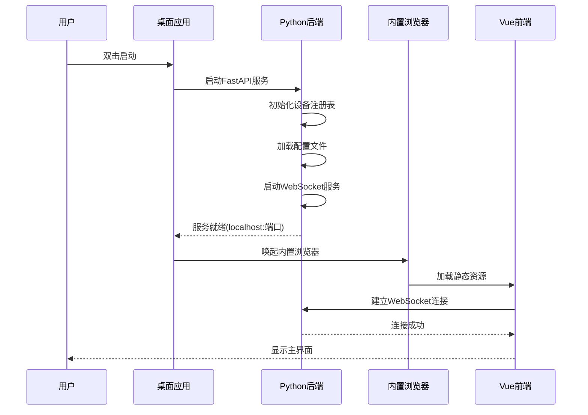

# 整体架构设计

> **文档版本**: v1.0.0  
> **最后更新**: 2026-03-15  
> **作者**: CAUC-SEP 技术团队

## 1. 架构概述

CAUC-SEP 自旋电子器件实验平台采用**内嵌式服务器架构**，将 Python 后端与前端静态资源打包为单一桌面应用。这种架构设计具有以下优势：

- **一键启动**: 双击 exe 文件后，自动启动后端服务并唤起内置浏览器窗口
- **零配置部署**: 无需手动配置服务器环境，开箱即用
- **本地优先**: 所有数据存储在本地，支持离线操作
- **安全隔离**: 桌面应用天然隔离外部网络攻击

### 1.1 架构设计原则

| 原则 | 说明 |
|------|------|
| **模块化** | 各功能模块独立封装，降低耦合度 |
| **可扩展** | 支持新设备驱动的热插拔接入 |
| **高可用** | 内置错误恢复机制和状态管理 |
| **实时性** | WebSocket 实现毫秒级数据推送 |
| **安全性** | 多层安全防护，软件限位保护 |

---

## 2. 系统层次架构

系统采用六层架构设计，从上到下依次为：

```mermaid
graph TB
    subgraph L1[用户界面层]
        direction LR
        UI1[电机控制面板]
        UI2[电磁铁控制面板]
        UI3[温度控制面板]
        UI4[压电控制面板]
        UI5[皮安表面板]
        UI6[数据分析面板]
        UI7[实验管理面板]
    end
    
    subgraph L2[前端框架层]
        direction LR
        Vue[Vue 3.4+]
        Pinia[Pinia状态管理]
        Router[Vue Router]
        ECharts[ECharts图表]
        WS[WebSocket客户端]
    end
    
    subgraph L3[API网关层]
        direction LR
        FastAPI[FastAPI]
        MW1[速率限制中间件]
        MW2[安全响应头中间件]
        MW3[审计日志中间件]
        MW4[CORS中间件]
    end
    
    subgraph L4[业务逻辑层]
        direction LR
        API1[电机API]
        API2[电磁铁API]
        API3[温度API]
        API4[压电API]
        API5[皮安表API]
        API6[分析API]
        API7[实验API]
        WSHandler[WebSocket处理器]
    end
    
    subgraph L5[硬件抽象层]
        direction LR
        HAL[AbstractDevice]
        DM2C[DM2C驱动]
        EM[电磁铁驱动]
        TC[温控驱动]
        PC[压电驱动]
        PA[皮安表驱动]
    end
    
    subgraph L6[数据存储层]
        direction LR
        SQLite[(SQLite)]
        HDF5[(HDF5)]
        Registry[设备注册表]
    end
    
    subgraph L7[硬件层]
        direction LR
        H1[DM2C驱动器]
        H2[电磁铁电源]
        H3[温控系统]
        H4[压电陶瓷]
        H5[皮安表]
    end
    
    L1 --> L2
    L2 --> L3
    L3 --> L4
    L4 --> L5
    L5 --> L6
    L5 --> L7
```



### 2.1 各层职责说明

| 层次 | 技术栈 | 核心职责 |
|------|--------|----------|
| **用户界面层** | Vue 3 + Element Plus | 提供可视化操作界面、实时波形显示、参数配置面板 |
| **前端框架层** | Vue 3.4+ / Pinia / ECharts | 状态管理、路由控制、图表渲染、WebSocket 通信 |
| **API网关层** | FastAPI + 中间件 | RESTful API 和 WebSocket 服务、请求过滤、安全防护 |
| **业务逻辑层** | Python 模块 | 实验引擎、设备管理器、数据存储管理等核心业务 |
| **硬件抽象层** | AbstractDevice | 统一设备驱动接口，实现设备无关的业务逻辑 |
| **数据存储层** | SQLite / HDF5 | 实验数据持久化、时序数据存储、设备配置管理 |
| **硬件层** | 物理设备 | DM2C 驱动器、电磁铁电源、温控系统、压电陶瓷、皮安表 |

---

## 3. 内嵌式服务器架构

### 3.1 启动流程



### 3.2 进程模型

```
┌─────────────────────────────────────────────────────────────┐
│                    CAUC-SEP Desktop App                      │
├─────────────────────────────────────────────────────────────┤
│  ┌─────────────────────────────────────────────────────┐    │
│  │              Main Process (主进程)                    │    │
│  │  - 应用生命周期管理                                    │    │
│  │  - 窗口管理                                           │    │
│  │  - 系统托盘                                           │    │
│  └─────────────────────────────────────────────────────┘    │
│                            │                                 │
│                            ▼                                 │
│  ┌─────────────────────────────────────────────────────┐    │
│  │           Backend Process (后端进程)                  │    │
│  │  ┌─────────────────────────────────────────────┐    │    │
│  │  │  FastAPI Server (localhost:8000)             │    │    │
│  │  │  - RESTful API                               │    │    │
│  │  │  - WebSocket Server                          │    │    │
│  │  │  - Static File Server                        │    │    │
│  │  └─────────────────────────────────────────────┘    │    │
│  │  ┌─────────────────────────────────────────────┐    │    │
│  │  │  Device Manager                              │    │    │
│  │  │  - 设备注册表                                 │    │    │
│  │  │  - 驱动管理器                                 │    │    │
│  │  │  - 实时调度器                                 │    │    │
│  │  └─────────────────────────────────────────────┘    │    │
│  │  ┌─────────────────────────────────────────────┐    │    │
│  │  │  Data Storage                                │    │    │
│  │  │  - SQLite (元数据)                           │    │    │
│  │  │  - HDF5 (时序数据)                           │    │    │
│  │  └─────────────────────────────────────────────┘    │    │
│  └─────────────────────────────────────────────────────┘    │
│                            │                                 │
│                            ▼                                 │
│  ┌─────────────────────────────────────────────────────┐    │
│  │          Renderer Process (渲染进程)                  │    │
│  │  ┌─────────────────────────────────────────────┐    │    │
│  │  │  Vue 3 Application                           │    │    │
│  │  │  - 组件渲染                                   │    │    │
│  │  │  - 状态管理 (Pinia)                          │    │    │
│  │  │  - WebSocket Client                          │    │    │
│  │  └─────────────────────────────────────────────┘    │    │
│  └─────────────────────────────────────────────────────┘    │
└─────────────────────────────────────────────────────────────┘
```

### 3.3 通信机制

| 通信方式 | 用途 | 特点 |
|----------|------|------|
| **HTTP/REST** | 设备控制、配置管理 | 同步请求，支持重试 |
| **WebSocket** | 实时数据推送 | 双向通信，低延迟 |
| **IPC** | 主进程与渲染进程通信 | 进程隔离，安全可靠 |

---

## 4. 架构决策记录 (ADR)

### ADR-001: 选择内嵌式服务器架构

**状态**: 已采纳

**背景**: 需要为实验室环境设计一个易于部署和使用的实验控制平台。

**决策**: 采用内嵌式服务器架构，将 Python 后端与前端打包为单一桌面应用。

**理由**:
1. **降低使用门槛**: 实验人员无需配置服务器环境
2. **提高安全性**: 本地运行，减少网络暴露风险
3. **简化部署**: 单一可执行文件，便于分发
4. **离线支持**: 所有功能本地可用

**后果**:
- 优点: 部署简单、安全性高、用户体验好
- 缺点: 单机部署，不支持多用户并发

---

### ADR-002: 选择 FastAPI 作为后端框架

**状态**: 已采纳

**背景**: 需要一个高性能、易用的 Python Web 框架来构建 API 服务。

**决策**: 选择 FastAPI 作为后端框架。

**理由**:
1. **异步支持**: 原生支持 async/await，适合 I/O 密集型操作
2. **自动文档**: 自动生成 OpenAPI 文档，降低维护成本
3. **类型安全**: 基于 Pydantic 的数据验证，减少运行时错误
4. **高性能**: 性能接近 Node.js 和 Go

**后果**:
- 优点: 开发效率高、文档完善、性能优秀
- 缺点: 相比 Flask 学习曲线稍陡

---

### ADR-003: 选择 Vue 3 作为前端框架

**状态**: 已采纳

**背景**: 需要一个现代化、响应式的前端框架来构建用户界面。

**决策**: 选择 Vue 3 + Composition API 作为前端框架。

**理由**:
1. **组合式 API**: 更好的逻辑复用和代码组织
2. **响应式系统**: 细粒度响应式更新，性能优秀
3. **生态完善**: Pinia、Vue Router、Element Plus 等成熟生态
4. **学习曲线**: 相比 React 更平缓

**后果**:
- 优点: 开发体验好、性能优秀、生态完善
- 缺点: 需要团队学习 Composition API

---

### ADR-004: 选择 SQLite + HDF5 混合存储

**状态**: 已采纳

**背景**: 需要存储实验元数据和大量时序测量数据。

**决策**: 使用 SQLite 存储元数据，HDF5 存储时序数据。

**理由**:
1. **SQLite**: 轻量级、零配置、事务支持
2. **HDF5**: 专为科学数据设计，支持大规模数组存储
3. **互补优势**: SQLite 适合结构化查询，HDF5 适合数值计算

**后果**:
- 优点: 存储高效、查询灵活、无需额外数据库服务
- 缺点: 需要维护两种存储格式

---

## 5. 扩展性设计

### 5.1 设备驱动扩展

系统采用**插件化设计**，支持新设备驱动的热插拔接入：

```python
# 新设备驱动实现示例
from backend.core.abstract import AbstractDevice, DeviceStatus

class NewDeviceDriver(AbstractDevice):
    """新设备驱动实现。"""
    
    async def connect(self) -> bool:
        """建立连接。"""
        self.status = DeviceStatus.CONNECTING
        # 实现连接逻辑
        self.status = DeviceStatus.READY
        return True
    
    async def disconnect(self) -> bool:
        """断开连接。"""
        # 实现断开逻辑
        self.status = DeviceStatus.DISCONNECTED
        return True
    
    async def read_status(self) -> dict:
        """读取状态。"""
        return {"status": self.status.value}
```

**扩展步骤**:
1. 继承 `AbstractDevice` 或 `AbstractStepper`
2. 实现所有抽象方法
3. 在设备注册表中注册新设备
4. 创建对应的 API 路由

### 5.2 功能模块扩展

系统支持**模块化扩展**，新增功能模块只需：

```
backend/
├── api/
│   └── new_feature.py      # 新增API路由
├── core/
│   └── new_feature.py      # 新增核心逻辑
├── schemas/
│   └── new_feature.py      # 新增数据模型
└── tests/
    └── test_new_feature.py # 新增测试用例
```

### 5.3 前端组件扩展

前端采用**组件化架构**，新增功能只需：

```
frontend/src/
├── views/
│   └── new-feature/
│       └── Index.vue       # 新增视图
├── components/
│   └── new-feature/
│       └── FeaturePanel.vue # 新增组件
├── stores/
│   └── newFeature.js       # 新增状态管理
└── api/
    └── newFeature.js       # 新增API调用
```

### 5.4 扩展点清单

| 扩展点 | 扩展方式 | 说明 |
|--------|----------|------|
| 设备驱动 | 继承 AbstractDevice | 支持新硬件设备接入 |
| API 路由 | 添加 FastAPI Router | 支持新 API 端点 |
| 中间件 | 实现 BaseHTTPMiddleware | 支持新的请求处理逻辑 |
| 前端组件 | Vue 单文件组件 | 支持新 UI 功能 |
| 状态管理 | Pinia Store | 支持新状态管理需求 |
| 数据存储 | 新增 Schema | 支持新数据结构 |

---

## 6. 部署架构

### 6.1 开发环境

```
┌─────────────────────────────────────────┐
│           Development Mode               │
├─────────────────────────────────────────┤
│  Backend:  uvicorn main:app --reload    │
│  Frontend: npm run dev                   │
│  Database: SQLite (dev.db)               │
│  Port:     8000 (API) + 5173 (Vite)     │
└─────────────────────────────────────────┘
```

### 6.2 生产环境

```
┌─────────────────────────────────────────┐
│           Production Mode                │
├─────────────────────────────────────────┤
│  Package:   CAUC-SEP.exe                │
│  Backend:   Embedded Python Runtime     │
│  Frontend:  Static Files (bundled)      │
│  Database:  SQLite + HDF5 (local)       │
│  Port:      localhost:随机端口           │
└─────────────────────────────────────────┘
```

---

## 7. 相关文档

- [后端架构](./后端架构.md)
- [前端架构](./前端架构.md)
- [数据流设计](./数据流设计.md)
- [核心模块详解](../04-核心模块/)
