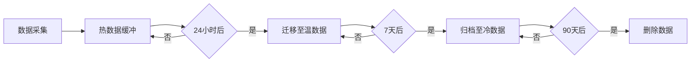
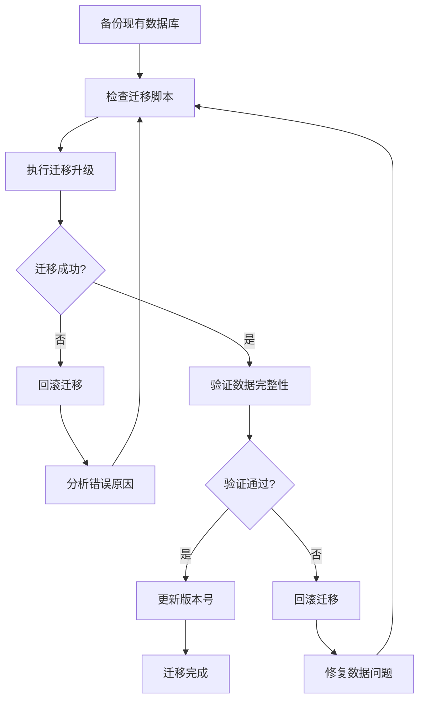
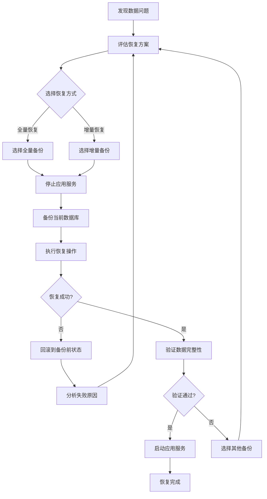

# 存储方案设计

> **文档版本**: v1.0
> **最后更新**: 2026-03-15
> **维护者**: CAUC-SEP 开发团队

## 目录

- [1. 概述](#1-概述)
- [2. SQLite 数据库配置](#2-sqlite-数据库配置)
- [3. HDF5 大数据存储](#3-hdf5-大数据存储)
- [4. 数据存储策略](#4-数据存储策略)
- [5. 数据迁移方案](#5-数据迁移方案)
- [6. 备份恢复策略](#6-备份恢复策略)
- [7. 性能优化](#7-性能优化)

---

## 1. 概述

CAUC-SEP 自旋电子器件实验平台采用混合存储架构，结合 SQLite 关系型数据库和 HDF5 科学数据格式，实现元数据管理与时序数据存储的分离，确保系统在单文件部署模式下的高效运行。

### 1.1 存储架构概览

```
CAUC-SEP 存储架构
├── 元数据存储 (SQLite)
│   ├── 用户信息
│   ├── 设备配置
│   ├── 实验记录
│   └── 操作日志
├── 时序数据存储 (SQLite + HDF5)
│   ├── 热数据 (内存缓冲)
│   ├── 温数据 (SQLite)
│   └── 冷数据 (HDF5压缩归档)
└── 文件存储
    ├── 实验数据导出 (CSV/JSON)
    ├── 配置文件 (YAML/JSON)
    └── 日志文件 (文本)
```

### 1.2 存储选型依据

| 存储类型 | 技术选型 | 选型依据 |
|----------|----------|----------|
| 元数据 | SQLite | 零配置、单文件部署、事务支持 |
| 时序数据 | SQLite + HDF5 | 高效压缩、科学计算支持、大数据量处理 |
| 配置文件 | YAML/JSON | 人类可读、易于编辑、跨平台兼容 |
| 日志文件 | 文本格式 | 简单可靠、易于排查问题 |

---

## 2. SQLite 数据库配置

### 2.1 数据库文件位置

数据库文件存储在用户应用数据目录下，避免权限问题：

```python
"""
数据库路径配置

Windows: %APPDATA%/CAUC-SEP/data/experiments.db
Linux: ~/.local/share/CAUC-SEP/data/experiments.db
macOS: ~/Library/Application Support/CAUC-SEP/data/experiments.db
"""

import os
from pathlib import Path

def get_database_path() -> Path:
    """
    获取数据库文件路径。

    根据操作系统自动选择合适的应用数据目录。

    Returns:
        Path: 数据库文件路径
    """
    app_name = "CAUC-SEP"

    if os.name == 'nt':  # Windows
        base_dir = Path(os.environ.get('APPDATA', '~'))
    elif os.name == 'posix':
        if 'darwin' in os.uname().sysname.lower():  # macOS
            base_dir = Path.home() / 'Library' / 'Application Support'
        else:  # Linux
            base_dir = Path.home() / '.local' / 'share'
    else:
        base_dir = Path.home()

    data_dir = base_dir / app_name / 'data'
    data_dir.mkdir(parents=True, exist_ok=True)

    return data_dir / 'experiments.db'
```

### 2.2 连接池配置

系统使用 SQLAlchemy 连接池管理数据库连接，提高并发性能：

```python
"""
数据库连接池管理模块

功能: 数据库连接池管理、健康检查、多数据库支持
"""

from dataclasses import dataclass
from enum import Enum
from sqlalchemy import create_engine, event
from sqlalchemy.pool import QueuePool, StaticPool


class DatabaseType(Enum):
    """数据库类型枚举。"""
    SQLITE = "sqlite"
    POSTGRESQL = "postgresql"
    MYSQL = "mysql"


@dataclass
class PoolConfig:
    """
    连接池配置。

    Attributes:
        pool_size: 连接池大小（默认5）
        max_overflow: 最大溢出连接数（默认10）
        pool_timeout: 获取连接超时时间（秒，默认30）
        pool_recycle: 连接回收时间（秒，默认3600）
        pool_pre_ping: 是否启用连接健康检查（默认True）
        echo_pool: 是否打印连接池日志（默认False）
    """

    pool_size: int = 5
    max_overflow: int = 10
    pool_timeout: float = 30.0
    pool_recycle: int = 3600
    pool_pre_ping: bool = True
    echo_pool: bool = False


def create_sqlite_engine(db_path: str, config: PoolConfig = None):
    """
    创建SQLite数据库引擎。

    Args:
        db_path: 数据库文件路径
        config: 连接池配置

    Returns:
        SQLAlchemy引擎实例
    """
    config = config or PoolConfig()

    # SQLite连接参数
    connect_args = {
        "check_same_thread": False,
        "timeout": 30,
        "isolation_level": None,  # 自动提交模式
    }

    # 内存数据库使用StaticPool，文件数据库使用QueuePool
    if db_path == ":memory:":
        pool_class = StaticPool
        pool_args = {}
    else:
        pool_class = QueuePool
        pool_args = {
            "pool_size": config.pool_size,
            "max_overflow": config.max_overflow,
            "pool_timeout": config.pool_timeout,
            "pool_recycle": config.pool_recycle,
            "pool_pre_ping": config.pool_pre_ping,
            "echo_pool": config.echo_pool,
        }

    engine = create_engine(
        f"sqlite:///{db_path}",
        connect_args=connect_args,
        poolclass=pool_class,
        **pool_args,
    )

    # 设置SQLite性能优化参数
    @event.listens_for(engine, "connect")
    def set_sqlite_pragma(dbapi_connection, connection_record):
        """设置SQLite性能优化参数。"""
        cursor = dbapi_connection.cursor()
        # 启用外键约束
        cursor.execute("PRAGMA foreign_keys=ON")
        # 设置日志模式为WAL（提高并发性能）
        cursor.execute("PRAGMA journal_mode=WAL")
        # 设置同步模式（性能与安全平衡）
        cursor.execute("PRAGMA synchronous=NORMAL")
        # 设置缓存大小（单位：页，每页约4KB）
        cursor.execute("PRAGMA cache_size=-64000")  # 64MB缓存
        # 设置临时存储在内存中
        cursor.execute("PRAGMA temp_store=MEMORY")
        # 设置忙等待时间（毫秒）
        cursor.execute("PRAGMA busy_timeout=30000")
        cursor.close()

    return engine
```

### 2.3 SQLite 性能优化参数

| 参数 | 设置值 | 说明 |
|------|--------|------|
| foreign_keys | ON | 启用外键约束 |
| journal_mode | WAL | 写前日志模式，提高并发性能 |
| synchronous | NORMAL | 同步模式，平衡性能与安全 |
| cache_size | -64000 | 缓存大小64MB |
| temp_store | MEMORY | 临时表存储在内存 |
| busy_timeout | 30000 | 忙等待超时30秒 |

### 2.4 数据库初始化

```python
"""
数据库初始化模块
"""

from sqlalchemy import create_engine
from sqlalchemy.orm import sessionmaker
from models import Base


def init_database(db_path: str = None):
    """
    初始化数据库。

    创建所有表结构，建立索引。

    Args:
        db_path: 数据库文件路径，默认使用系统标准路径

    Returns:
        tuple: (engine, session_factory)
    """
    if db_path is None:
        db_path = str(get_database_path())

    # 创建引擎
    engine = create_sqlite_engine(db_path)

    # 创建所有表
    Base.metadata.create_all(engine)

    # 创建会话工厂
    session_factory = sessionmaker(
        bind=engine,
        autocommit=False,
        autoflush=False,
        expire_on_commit=False,
    )

    return engine, session_factory
```

---

## 3. HDF5 大数据存储

### 3.1 HDF5 存储概述

HDF5（Hierarchical Data Format 5）是一种用于存储和组织大量数据的文件格式，特别适合科学计算和大数据应用。

#### HDF5 优势

| 特性 | 说明 |
|------|------|
| 高效压缩 | 支持多种压缩算法，显著减少存储空间 |
| 分层结构 | 类似文件系统的层次结构，便于组织数据 |
| 并行I/O | 支持并行读写，提高大数据处理效率 |
| 元数据支持 | 可存储丰富的元数据信息 |
| 跨平台 | 支持多种编程语言和操作系统 |

### 3.2 HDF5 文件结构

```
experiment_data.h5
├── metadata/                    # 实验元数据
│   ├── experiment_info          # 实验基本信息
│   ├── device_config            # 设备配置
│   └── user_info                # 用户信息
├── timeseries/                  # 时序数据
│   ├── position                 # 位置数据
│   ├── magnetic_field           # 磁场数据
│   ├── current                  # 电流数据
│   └── temperature              # 温度数据
├── processed/                   # 处理后的数据
│   ├── normalized               # 归一化数据
│   └── analyzed                 # 分析结果
└── archives/                    # 归档数据
    └── compressed_datasets      # 压缩数据集
```

### 3.3 HDF5 存储实现

```python
"""
HDF5数据存储模块

功能: 使用HDF5格式存储大规模实验数据
"""

import h5py
import numpy as np
from datetime import datetime
from pathlib import Path


class HDF5Storage:
    """
    HDF5数据存储管理器。

    提供高效的时序数据存储和检索功能。

    Attributes:
        file_path: HDF5文件路径
        compression: 压缩算法
        compression_level: 压缩级别
    """

    def __init__(
        self,
        file_path: str,
        compression: str = "gzip",
        compression_level: int = 4
    ):
        """
        初始化HDF5存储管理器。

        Args:
            file_path: HDF5文件路径
            compression: 压缩算法（gzip, lzf, szip）
            compression_level: 压缩级别（0-9）
        """
        self.file_path = Path(file_path)
        self.compression = compression
        self.compression_level = compression_level

        # 确保目录存在
        self.file_path.parent.mkdir(parents=True, exist_ok=True)

    def create_experiment_dataset(
        self,
        experiment_id: int,
        metadata: dict = None
    ):
        """
        为实验创建数据集结构。

        Args:
            experiment_id: 实验ID
            metadata: 实验元数据
        """
        with h5py.File(self.file_path, 'a') as f:
            # 创建实验组
            exp_group = f.create_group(f"experiments/{experiment_id}")

            # 存储元数据
            if metadata:
                meta_group = exp_group.create_group("metadata")
                for key, value in metadata.items():
                    meta_group.attrs[key] = str(value)

            # 创建时序数据组
            timeseries = exp_group.create_group("timeseries")

            # 创建数据集（可扩展）
            maxshape = (None,)  # 无限维度

            timeseries.create_dataset(
                "timestamp",
                shape=(0,),
                maxshape=maxshape,
                dtype='float64',
                compression=self.compression,
                compression_opts=self.compression_level
            )
            timeseries.create_dataset(
                "position",
                shape=(0,),
                maxshape=maxshape,
                dtype='float64',
                compression=self.compression,
                compression_opts=self.compression_level
            )
            timeseries.create_dataset(
                "magnetic_field",
                shape=(0,),
                maxshape=maxshape,
                dtype='float64',
                compression=self.compression,
                compression_opts=self.compression_level
            )
            timeseries.create_dataset(
                "current",
                shape=(0,),
                maxshape=maxshape,
                dtype='float64',
                compression=self.compression,
                compression_opts=self.compression_level
            )
            timeseries.create_dataset(
                "temperature",
                shape=(0,),
                maxshape=maxshape,
                dtype='float64',
                compression=self.compression,
                compression_opts=self.compression_level
            )

    def append_data(
        self,
        experiment_id: int,
        data: dict
    ):
        """
        追加时序数据。

        Args:
            experiment_id: 实验ID
            data: 数据字典，包含timestamp, position, magnetic_field等
        """
        with h5py.File(self.file_path, 'a') as f:
            timeseries = f[f"experiments/{experiment_id}/timeseries"]

            for key, values in data.items():
                if key in timeseries:
                    dataset = timeseries[key]
                    old_size = dataset.shape[0]
                    new_size = old_size + len(values)
                    dataset.resize(new_size, axis=0)
                    dataset[old_size:new_size] = values

    def read_data(
        self,
        experiment_id: int,
        start_idx: int = None,
        end_idx: int = None
    ) -> dict:
        """
        读取时序数据。

        Args:
            experiment_id: 实验ID
            start_idx: 起始索引
            end_idx: 结束索引

        Returns:
            数据字典
        """
        with h5py.File(self.file_path, 'r') as f:
            timeseries = f[f"experiments/{experiment_id}/timeseries"]

            result = {}
            for key in timeseries.keys():
                dataset = timeseries[key]
                if start_idx is not None and end_idx is not None:
                    result[key] = dataset[start_idx:end_idx]
                else:
                    result[key] = dataset[:]

            return result

    def get_statistics(self, experiment_id: int) -> dict:
        """
        获取实验数据统计信息。

        Args:
            experiment_id: 实验ID

        Returns:
            统计信息字典
        """
        with h5py.File(self.file_path, 'r') as f:
            timeseries = f[f"experiments/{experiment_id}/timeseries"]

            stats = {}
            for key in timeseries.keys():
                dataset = timeseries[key]
                stats[key] = {
                    "count": dataset.shape[0],
                    "size_bytes": dataset.nbytes,
                    "compressed_bytes": dataset.id.get_storage_size(),
                }

            return stats
```

---

## 4. 数据存储策略

### 4.1 数据分层存储

系统根据数据访问频率和时效性进行分层管理：

```python
"""
时序数据分层存储策略

热数据: 最近24小时，高频访问，内存缓存
温数据: 7天内，中频访问，SQLite存储
冷数据: 30天以上，低频访问，HDF5压缩归档
"""

from enum import Enum
from dataclasses import dataclass
from datetime import datetime, timedelta


class DataTier(Enum):
    """数据分层枚举。"""

    HOT = "hot"      # 热数据：最近24小时
    WARM = "warm"    # 温数据：7天内
    COLD = "cold"    # 冷数据：30天以上


class CompressionType(Enum):
    """压缩类型枚举。"""

    NONE = "none"
    GZIP = "gzip"
    ZLIB = "zlib"
    NPZ = "npz"


@dataclass
class TierConfig:
    """
    数据层配置。

    Attributes:
        tier: 数据层类型
        max_age_hours: 最大保留时间（小时）
        compression: 压缩类型
        storage_path: 存储路径
        max_size_mb: 最大存储大小（MB）
        auto_archive: 是否自动归档
    """

    tier: DataTier
    max_age_hours: int = 168
    compression: CompressionType = CompressionType.GZIP
    storage_path: str = ""
    max_size_mb: int = 1024
    auto_archive: bool = True
```

### 4.2 数据分层配置

| 数据层 | 保留时间 | 存储介质 | 压缩方式 | 访问频率 |
|--------|----------|----------|----------|----------|
| 热数据 | 24小时 | 内存缓冲 | 无压缩 | 高频访问 |
| 温数据 | 7天 | SQLite | GZIP | 中频访问 |
| 冷数据 | 30天+ | HDF5 | GZIP | 低频访问 |

### 4.3 自动归档策略

```python
"""
数据自动归档模块
"""

import asyncio
import gzip
import json
import logging
from datetime import datetime, timedelta
from pathlib import Path
from threading import RLock

logger = logging.getLogger(__name__)


class DataArchiver:
    """
    数据归档器。

    负责将冷数据压缩归档到文件系统，
    支持多种压缩格式和增量归档。
    """

    def __init__(
        self,
        storage_path: Path,
        compression: CompressionType = CompressionType.GZIP
    ):
        """
        初始化数据归档器。

        Args:
            storage_path: 存储根路径
            compression: 默认压缩类型
        """
        self._storage_path = storage_path
        self._compression = compression
        self._lock = RLock()

        # 创建归档目录
        self._archive_path = storage_path / "archives"
        self._archive_path.mkdir(parents=True, exist_ok=True)

        # 归档索引
        self._archive_index = {}
        self._load_archive_index()

    async def auto_archive(self) -> int:
        """
        自动归档过期数据。

        Returns:
            归档的记录数
        """
        # 实现自动归档逻辑
        archived_count = 0

        # 查询需要归档的数据
        # ... 实现细节 ...

        return archived_count

    async def archive_experiment(self, experiment_id: int) -> int:
        """
        归档指定实验的数据。

        Args:
            experiment_id: 实验ID

        Returns:
            归档的记录数
        """
        # 实现实验归档逻辑
        # ... 实现细节 ...

        return 0
```

### 4.4 数据生命周期管理



---

## 5. 数据迁移方案

### 5.1 迁移工具

```python
"""
数据库迁移工具

使用Alembic进行数据库版本管理
"""

from alembic import op
import sqlalchemy as sa


# 迁移版本号
revision = '001'
down_revision = None


def upgrade():
    """
    升级数据库版本。

    执行数据库结构变更和数据迁移。
    """
    # 示例：添加新列
    op.add_column(
        'users',
        sa.Column('avatar', sa.String(500), nullable=True)
    )

    # 创建新索引
    op.create_index('ix_users_avatar', 'users', ['avatar'])

    # 数据迁移
    connection = op.get_bind()
    connection.execute(
        "UPDATE users SET avatar = '' WHERE avatar IS NULL"
    )


def downgrade():
    """
    降级数据库版本。

    回滚数据库结构变更。
    """
    # 删除索引
    op.drop_index('ix_users_avatar', 'users')

    # 删除列
    op.drop_column('users', 'avatar')
```

### 5.2 迁移流程



### 5.3 迁移最佳实践

1. **备份优先**
   - 执行迁移前必须备份数据库
   - 保留多个历史备份版本
   - 验证备份文件完整性

2. **测试验证**
   - 在测试环境先执行迁移
   - 验证迁移脚本正确性
   - 检查数据完整性

3. **回滚准备**
   - 准备回滚脚本
   - 记录迁移前状态
   - 确保可快速回滚

### 5.4 数据迁移脚本示例

```python
"""
数据迁移脚本：从旧版本迁移到新版本

迁移内容：
1. 添加用户头像字段
2. 创建实验配置表
3. 迁移历史数据
"""

import json
import logging
from datetime import datetime
from pathlib import Path
from sqlalchemy import create_engine
from sqlalchemy.orm import sessionmaker

logger = logging.getLogger(__name__)


def migrate_v1_to_v2(old_db_path: str, new_db_path: str):
    """
    从v1版本迁移到v2版本。

    Args:
        old_db_path: 旧数据库路径
        new_db_path: 新数据库路径
    """
    # 创建引擎
    old_engine = create_engine(f"sqlite:///{old_db_path}")
    new_engine = create_engine(f"sqlite:///{new_db_path}")

    OldSession = sessionmaker(bind=old_engine)
    NewSession = sessionmaker(bind=new_engine)

    old_session = OldSession()
    new_session = NewSession()

    try:
        # 迁移用户数据
        logger.info("Migrating users...")
        users = old_session.execute("SELECT * FROM users")
        for user in users:
            new_session.execute(
                """
                INSERT INTO users (id, username, email, password_hash, role, avatar, preferences, created_at, updated_at, is_active)
                VALUES (:id, :username, :email, :password_hash, :role, :avatar, :preferences, :created_at, :updated_at, :is_active)
                """,
                {
                    **user,
                    'avatar': None,
                    'preferences': json.dumps({'theme': 'light'}),
                }
            )

        # 迁移实验数据
        logger.info("Migrating experiments...")
        experiments = old_session.execute("SELECT * FROM experiments")
        for exp in experiments:
            new_session.execute(
                """
                INSERT INTO experiments (id, exp_name, exp_type, user_id, sequence_config, status, created_at, started_at, completed_at, data_file_path, experiment_metadata)
                VALUES (:id, :exp_name, :exp_type, :user_id, :sequence_config, :status, :created_at, :started_at, :completed_at, :data_file_path, :experiment_metadata)
                """,
                exp
            )

        new_session.commit()
        logger.info("Migration completed successfully")

    except Exception as e:
        new_session.rollback()
        logger.error(f"Migration failed: {e}")
        raise
    finally:
        old_session.close()
        new_session.close()
```

---

## 6. 备份恢复策略

### 6.1 备份策略

#### 备份类型

| 类型 | 频率 | 保留期限 | 存储位置 |
|------|------|----------|----------|
| 全量备份 | 每日 | 30天 | 本地 + 云存储 |
| 增量备份 | 每小时 | 7天 | 本地 |
| 实时备份 | 实时 | 24小时 | 内存缓冲 |

#### 备份配置

```python
"""
数据库备份配置
"""

from dataclasses import dataclass
from enum import Enum


class BackupType(Enum):
    """备份类型枚举。"""
    FULL = "full"        # 全量备份
    INCREMENTAL = "incremental"  # 增量备份
    REALTIME = "realtime"  # 实时备份


@dataclass
class BackupConfig:
    """
    备份配置。

    Attributes:
        backup_type: 备份类型
        schedule: 备份计划（cron表达式）
        retention_days: 保留天数
        storage_path: 存储路径
        compress: 是否压缩
        encrypt: 是否加密
    """

    backup_type: BackupType
    schedule: str
    retention_days: int
    storage_path: str
    compress: bool = True
    encrypt: bool = False


# 默认备份配置
DEFAULT_BACKUP_CONFIGS = [
    BackupConfig(
        backup_type=BackupType.FULL,
        schedule="0 2 * * *",  # 每天凌晨2点
        retention_days=30,
        storage_path="backups/full",
        compress=True,
        encrypt=False,
    ),
    BackupConfig(
        backup_type=BackupType.INCREMENTAL,
        schedule="0 * * * *",  # 每小时
        retention_days=7,
        storage_path="backups/incremental",
        compress=True,
        encrypt=False,
    ),
]
```

### 6.2 备份实现

```python
"""
数据库备份模块
"""

import gzip
import logging
import shutil
from datetime import datetime
from pathlib import Path
from typing import Optional

logger = logging.getLogger(__name__)


class DatabaseBackup:
    """
    数据库备份管理器。

    提供数据库备份、恢复和清理功能。
    """

    def __init__(self, db_path: str, backup_dir: str):
        """
        初始化备份管理器。

        Args:
            db_path: 数据库文件路径
            backup_dir: 备份目录
        """
        self.db_path = Path(db_path)
        self.backup_dir = Path(backup_dir)
        self.backup_dir.mkdir(parents=True, exist_ok=True)

    def create_backup(
        self,
        backup_type: BackupType = BackupType.FULL,
        compress: bool = True
    ) -> str:
        """
        创建数据库备份。

        Args:
            backup_type: 备份类型
            compress: 是否压缩

        Returns:
            备份文件路径
        """
        timestamp = datetime.now().strftime("%Y%m%d_%H%M%S")
        backup_filename = f"experiments_{backup_type.value}_{timestamp}.db"
        backup_path = self.backup_dir / backup_filename

        if compress:
            backup_path = backup_path.with_suffix('.db.gz')

            # 压缩备份
            with open(self.db_path, 'rb') as f_in:
                with gzip.open(backup_path, 'wb') as f_out:
                    shutil.copyfileobj(f_in, f_out)
        else:
            # 直接复制
            shutil.copy2(self.db_path, backup_path)

        logger.info(f"Backup created: {backup_path}")
        return str(backup_path)

    def restore_backup(self, backup_path: str) -> bool:
        """
        从备份恢复数据库。

        Args:
            backup_path: 备份文件路径

        Returns:
            是否成功
        """
        backup_file = Path(backup_path)

        if not backup_file.exists():
            logger.error(f"Backup file not found: {backup_path}")
            return False

        try:
            # 备份当前数据库
            current_backup = self.create_backup(BackupType.FULL, compress=True)

            # 恢复数据库
            if backup_file.suffix == '.gz':
                with gzip.open(backup_file, 'rb') as f_in:
                    with open(self.db_path, 'wb') as f_out:
                        shutil.copyfileobj(f_in, f_out)
            else:
                shutil.copy2(backup_file, self.db_path)

            logger.info(f"Database restored from: {backup_path}")
            return True

        except Exception as e:
            logger.error(f"Restore failed: {e}")
            return False

    def list_backups(self) -> list[dict]:
        """
        列出所有备份文件。

        Returns:
            备份文件列表
        """
        backups = []

        for backup_file in self.backup_dir.glob("experiments_*.db*"):
            stat = backup_file.stat()
            backups.append({
                "path": str(backup_file),
                "filename": backup_file.name,
                "size_bytes": stat.st_size,
                "created_at": datetime.fromtimestamp(stat.st_ctime).isoformat(),
                "modified_at": datetime.fromtimestamp(stat.st_mtime).isoformat(),
            })

        # 按修改时间排序
        backups.sort(key=lambda x: x["modified_at"], reverse=True)
        return backups

    def cleanup_old_backups(self, retention_days: int) -> int:
        """
        清理过期备份文件。

        Args:
            retention_days: 保留天数

        Returns:
            删除的文件数
        """
        cutoff_time = datetime.now() - timedelta(days=retention_days)
        deleted_count = 0

        for backup_file in self.backup_dir.glob("experiments_*.db*"):
            file_time = datetime.fromtimestamp(backup_file.stat().st_mtime)

            if file_time < cutoff_time:
                backup_file.unlink()
                deleted_count += 1
                logger.info(f"Deleted old backup: {backup_file}")

        return deleted_count
```

### 6.3 恢复流程



### 6.4 灾难恢复

```python
"""
灾难恢复模块
"""

import logging
from datetime import datetime
from pathlib import Path
from typing import Optional

logger = logging.getLogger(__name__)


class DisasterRecovery:
    """
    灾难恢复管理器。

    提供完整的灾难恢复流程管理。
    """

    def __init__(self, db_path: str, backup_dir: str, cloud_backup_path: Optional[str] = None):
        """
        初始化灾难恢复管理器。

        Args:
            db_path: 数据库文件路径
            backup_dir: 本地备份目录
            cloud_backup_path: 云备份路径
        """
        self.db_path = Path(db_path)
        self.backup_dir = Path(backup_dir)
        self.cloud_backup_path = Path(cloud_backup_path) if cloud_backup_path else None
        self.backup_manager = DatabaseBackup(db_path, backup_dir)

    def assess_damage(self) -> dict:
        """
        评估数据损坏程度。

        Returns:
            损坏评估报告
        """
        report = {
            "timestamp": datetime.now().isoformat(),
            "database_exists": self.db_path.exists(),
            "database_size": 0,
            "database_readable": False,
            "tables_status": {},
        }

        if self.db_path.exists():
            report["database_size"] = self.db_path.stat().st_size

            try:
                # 尝试读取数据库
                import sqlite3
                conn = sqlite3.connect(str(self.db_path))
                cursor = conn.cursor()

                # 检查表完整性
                cursor.execute("SELECT name FROM sqlite_master WHERE type='table'")
                tables = cursor.fetchall()

                for (table_name,) in tables:
                    try:
                        cursor.execute(f"PRAGMA integrity_check({table_name})")
                        result = cursor.fetchone()
                        report["tables_status"][table_name] = {
                            "status": "ok" if result[0] == "ok" else "corrupted",
                            "message": result[0]
                        }
                    except Exception as e:
                        report["tables_status"][table_name] = {
                            "status": "error",
                            "message": str(e)
                        }

                conn.close()
                report["database_readable"] = True

            except Exception as e:
                report["error"] = str(e)

        return report

    def find_best_backup(self) -> Optional[str]:
        """
        查找最佳备份文件。

        Returns:
            备份文件路径
        """
        backups = self.backup_manager.list_backups()

        if not backups:
            # 尝试从云备份恢复
            if self.cloud_backup_path and self.cloud_backup_path.exists():
                cloud_backups = list(self.cloud_backup_path.glob("experiments_*.db*"))
                if cloud_backups:
                    # 选择最新的云备份
                    latest = max(cloud_backups, key=lambda p: p.stat().st_mtime)
                    return str(latest)
            return None

        # 返回最新的本地备份
        return backups[0]["path"]

    def execute_recovery(self) -> dict:
        """
        执行灾难恢复流程。

        Returns:
            恢复报告
        """
        report = {
            "timestamp": datetime.now().isoformat(),
            "steps": [],
            "success": False,
        }

        try:
            # 1. 评估损坏
            assessment = self.assess_damage()
            report["steps"].append({
                "step": "assess_damage",
                "result": assessment
            })

            # 2. 查找备份
            backup_path = self.find_best_backup()
            if not backup_path:
                raise Exception("No backup found")

            report["steps"].append({
                "step": "find_backup",
                "result": {"backup_path": backup_path}
            })

            # 3. 执行恢复
            success = self.backup_manager.restore_backup(backup_path)
            report["steps"].append({
                "step": "restore_backup",
                "result": {"success": success}
            })

            if success:
                # 4. 验证恢复
                verification = self.assess_damage()
                report["steps"].append({
                    "step": "verify_recovery",
                    "result": verification
                })

                report["success"] = verification["database_readable"]

        except Exception as e:
            report["error"] = str(e)
            logger.error(f"Recovery failed: {e}")

        return report
```

---

## 7. 性能优化

### 7.1 查询性能优化

#### 索引优化

```python
"""
查询性能监控与索引优化模块
"""

import logging
import time
from collections import defaultdict
from dataclasses import dataclass, field
from datetime import datetime
from threading import Lock
from typing import Any

from sqlalchemy import event, text

logger = logging.getLogger(__name__)


@dataclass
class QueryStatistics:
    """查询统计信息。"""

    query_count: int = 0
    total_time_ms: float = 0.0
    avg_time_ms: float = 0.0
    max_time_ms: float = 0.0
    min_time_ms: float = float('inf')
    slow_query_count: int = 0


class QueryPerformanceMonitor:
    """
    查询性能监控器。

    监控SQL查询性能，识别慢查询和优化机会。
    """

    def __init__(self, db_path: str, slow_query_threshold_ms: float = 100.0):
        """
        初始化查询性能监控器。

        Args:
            db_path: 数据库路径
            slow_query_threshold_ms: 慢查询阈值（毫秒）
        """
        self.db_path = db_path
        self.slow_query_threshold_ms = slow_query_threshold_ms
        self._lock = Lock()

        # 查询统计
        self._query_stats: dict[str, QueryStatistics] = defaultdict(QueryStatistics)
        self._slow_queries: list[dict[str, Any]] = []
        self._query_patterns: dict[str, int] = defaultdict(int)

    def record_query(self, sql: str, duration_ms: float) -> None:
        """
        记录查询执行情况。

        Args:
            sql: SQL语句
            duration_ms: 执行时间（毫秒）
        """
        # 规范化SQL（移除具体值）
        normalized_sql = self._normalize_sql(sql)

        with self._lock:
            stats = self._query_stats[normalized_sql]
            stats.query_count += 1
            stats.total_time_ms += duration_ms
            stats.avg_time_ms = stats.total_time_ms / stats.query_count
            stats.max_time_ms = max(stats.max_time_ms, duration_ms)
            stats.min_time_ms = min(stats.min_time_ms, duration_ms)

            # 记录慢查询
            if duration_ms > self.slow_query_threshold_ms:
                stats.slow_query_count += 1
                self._slow_queries.append({
                    "sql": sql,
                    "normalized_sql": normalized_sql,
                    "duration_ms": duration_ms,
                    "timestamp": datetime.now().isoformat(),
                })

            # 记录查询模式
            self._query_patterns[normalized_sql] += 1

    def _normalize_sql(self, sql: str) -> str:
        """
        规范化SQL语句。

        移除具体值，保留SQL结构。

        Args:
            sql: 原始SQL语句

        Returns:
            规范化的SQL语句
        """
        import re

        # 移除字符串值
        sql = re.sub(r"'[^']*'", "'?'", sql)
        # 移除数字值
        sql = re.sub(r'\b\d+\b', '?', sql)
        # 移除多余空格
        sql = re.sub(r'\s+', ' ', sql).strip()

        return sql

    def get_statistics(self) -> dict[str, Any]:
        """
        获取查询统计信息。

        Returns:
            统计信息字典
        """
        with self._lock:
            return {
                "query_count": sum(s.query_count for s in self._query_stats.values()),
                "slow_query_count": sum(s.slow_query_count for s in self._query_stats.values()),
                "avg_time_ms": sum(s.avg_time_ms for s in self._query_stats.values()) / len(self._query_stats) if self._query_stats else 0,
                "unique_queries": len(self._query_stats),
            }

    def get_slow_queries(self, limit: int = 100) -> list[dict[str, Any]]:
        """
        获取慢查询列表。

        Args:
            limit: 最大返回数量

        Returns:
            慢查询列表
        """
        with self._lock:
            return sorted(
                self._slow_queries,
                key=lambda x: x["duration_ms"],
                reverse=True
            )[:limit]


def setup_query_monitoring(engine, monitor: QueryPerformanceMonitor) -> None:
    """
    设置查询性能监控。

    Args:
        engine: SQLAlchemy引擎
        monitor: 性能监控器
    """
    @event.listens_for(engine, "before_cursor_execute")
    def before_cursor_execute(conn, cursor, statement, parameters, context, executemany):
        """查询执行前记录时间。"""
        context._query_start_time = time.time()

    @event.listens_for(engine, "after_cursor_execute")
    def after_cursor_execute(conn, cursor, statement, parameters, context, executemany):
        """查询执行后记录统计。"""
        if hasattr(context, '_query_start_time'):
            duration_ms = (time.time() - context._query_start_time) * 1000
            monitor.record_query(statement, duration_ms)
```

### 7.2 写入性能优化

```python
"""
写入性能优化模块
"""

from collections import defaultdict
from threading import Lock
from typing import Any


class WriteBuffer:
    """
    写入缓冲区。

    批量写入数据，减少数据库I/O操作。
    """

    def __init__(self, buffer_size: int = 1000, flush_interval: float = 5.0):
        """
        初始化写入缓冲区。

        Args:
            buffer_size: 缓冲区大小
            flush_interval: 刷新间隔（秒）
        """
        self.buffer_size = buffer_size
        self.flush_interval = flush_interval
        self._buffer: dict[str, list[dict[str, Any]]] = defaultdict(list)
        self._lock = Lock()
        self._last_flush_time = time.time()

    def add(self, table: str, data: dict[str, Any]) -> bool:
        """
        添加数据到缓冲区。

        Args:
            table: 表名
            data: 数据字典

        Returns:
            是否触发刷新
        """
        should_flush = False

        with self._lock:
            self._buffer[table].append(data)

            # 检查是否需要刷新
            total_size = sum(len(buf) for buf in self._buffer.values())
            time_elapsed = time.time() - self._last_flush_time

            if total_size >= self.buffer_size or time_elapsed >= self.flush_interval:
                should_flush = True

        return should_flush

    def flush(self, session) -> int:
        """
        刷新缓冲区到数据库。

        Args:
            session: 数据库会话

        Returns:
            写入的记录数
        """
        total_written = 0

        with self._lock:
            for table, records in self._buffer.items():
                if records:
                    # 批量插入
                    session.bulk_insert_mappings(
                        self._get_model_class(table),
                        records
                    )
                    total_written += len(records)

            # 清空缓冲区
            self._buffer.clear()
            self._last_flush_time = time.time()

        return total_written
```

### 7.3 缓存策略

```python
"""
数据缓存模块
"""

from collections import OrderedDict
from threading import Lock
from typing import Any, Optional


class LRUCache:
    """
    LRU缓存实现。

    提供最近最少使用缓存淘汰策略。
    """

    def __init__(self, max_size: int = 1000, ttl_seconds: int = 300):
        """
        初始化LRU缓存。

        Args:
            max_size: 最大缓存数量
            ttl_seconds: 缓存过期时间（秒）
        """
        self.max_size = max_size
        self.ttl_seconds = ttl_seconds
        self._cache: OrderedDict[str, tuple[Any, float]] = OrderedDict()
        self._lock = Lock()

    def get(self, key: str) -> Optional[Any]:
        """
        获取缓存值。

        Args:
            key: 缓存键

        Returns:
            缓存值，不存在或过期返回None
        """
        with self._lock:
            if key not in self._cache:
                return None

            value, timestamp = self._cache[key]

            # 检查是否过期
            if time.time() - timestamp > self.ttl_seconds:
                del self._cache[key]
                return None

            # 移动到末尾（最近使用）
            self._cache.move_to_end(key)
            return value

    def set(self, key: str, value: Any) -> None:
        """
        设置缓存值。

        Args:
            key: 缓存键
            value: 缓存值
        """
        with self._lock:
            if key in self._cache:
                # 更新已存在的键
                self._cache.move_to_end(key)
            else:
                # 检查容量
                if len(self._cache) >= self.max_size:
                    # 删除最旧的项
                    self._cache.popitem(last=False)

            self._cache[key] = (value, time.time())

    def clear(self) -> None:
        """清空缓存。"""
        with self._lock:
            self._cache.clear()
```

### 7.4 性能监控指标

| 指标 | 说明 | 目标值 |
|------|------|--------|
| 查询响应时间 | 平均查询耗时 | < 50ms |
| 慢查询比例 | 超过阈值的查询占比 | < 1% |
| 写入吞吐量 | 每秒写入记录数 | > 1000 |
| 缓存命中率 | 缓存命中比例 | > 80% |
| 连接池使用率 | 连接池占用比例 | < 70% |

---

## 附录

### A. 配置参数参考

```yaml
# 数据库配置
database:
  type: sqlite
  path: "%APPDATA%/CAUC-SEP/data/experiments.db"
  
  # 连接池配置
  pool:
    size: 5
    max_overflow: 10
    timeout: 30
    recycle: 3600
    pre_ping: true

  # SQLite优化参数
  pragmas:
    foreign_keys: ON
    journal_mode: WAL
    synchronous: NORMAL
    cache_size: -64000  # 64MB
    temp_store: MEMORY
    busy_timeout: 30000

# 存储配置
storage:
  # 数据分层配置
  tiers:
    hot:
      max_age_hours: 24
      compression: none
      max_size_mb: 512
    warm:
      max_age_hours: 168
      compression: gzip
      max_size_mb: 2048
    cold:
      max_age_hours: 720
      compression: gzip
      max_size_mb: 10240

  # HDF5配置
  hdf5:
    compression: gzip
    compression_level: 4
    chunk_size: 10000

# 备份配置
backup:
  full:
    schedule: "0 2 * * *"
    retention_days: 30
    compress: true
  incremental:
    schedule: "0 * * * *"
    retention_days: 7
    compress: true

# 性能监控配置
monitoring:
  slow_query_threshold_ms: 100
  query_cache_size: 100
  write_buffer_size: 1000
  flush_interval: 5.0
```

### B. 相关文档

- [数据模型](file:///d:/cauc-sep/docs/technical-docs/05-数据库设计/数据模型.md) - 数据模型设计
- [后端架构](file:///d:/cauc-sep/docs/technical-docs/03-系统架构/后端架构.md) - 后端系统架构
- [数据流设计](file:///d:/cauc-sep/docs/technical-docs/03-系统架构/数据流设计.md) - 数据流转设计

### C. 源代码参考

- [database.py](file:///d:/cauc-sep/backend/core/storage/database.py) - 数据库连接池管理
- [data_storage.py](file:///d:/cauc-sep/backend/core/storage/data_storage.py) - 数据存储管理
- [timeseries_storage.py](file:///d:/cauc-sep/backend/core/storage/timeseries_storage.py) - 时序数据存储

---

> **文档维护**: 本文档随项目迭代持续更新，如有疑问请联系开发团队。
