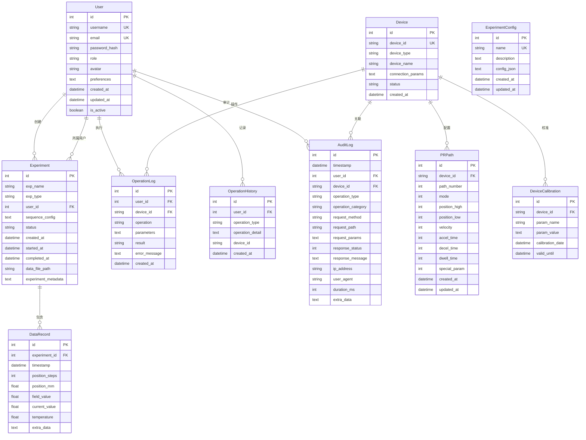
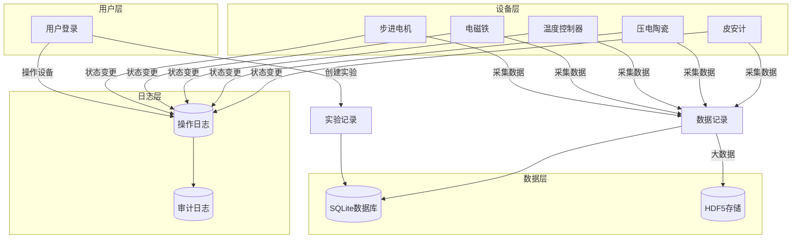

# 数据模型设计

> **文档版本**: v1.0
> **最后更新**: 2026-03-15
> **维护者**: CAUC-SEP 开发团队

## 目录

- [1. 概述](#1-概述)
- [2. 实体关系图](#2-实体关系图)
- [3. 核心数据模型](#3-核心数据模型)
- [4. 辅助数据模型](#4-辅助数据模型)
- [5. SQLAlchemy 模型定义](#5-sqlalchemy-模型定义)
- [6. 数据库约束与索引](#6-数据库约束与索引)
- [7. 最佳实践](#7-最佳实践)

---

## 1. 概述

CAUC-SEP 自旋电子器件实验平台采用 SQLite 本地数据库，适配单文件部署需求。数据库设计遵循第三范式（3NF），确保数据一致性、完整性和查询效率。

### 1.1 设计原则

| 原则 | 说明 |
|------|------|
| **规范化** | 遵循第三范式，消除数据冗余 |
| **完整性** | 通过外键约束和检查约束保证数据完整性 |
| **性能优化** | 合理设计索引，优化查询性能 |
| **可扩展性** | 预留扩展字段，支持未来功能扩展 |
| **审计追踪** | 完整的操作日志和审计记录 |

### 1.2 数据库架构

```
CAUC-SEP 数据库架构
├── 用户管理
│   └── users (用户表)
├── 设备管理
│   ├── devices (设备表)
│   ├── pr_paths (PR路径配置表)
│   └── device_calibrations (设备校准参数表)
├── 实验管理
│   ├── experiments (实验表)
│   ├── data_records (数据记录表)
│   └── experiment_configs (实验配置表)
└── 日志管理
    ├── operation_logs (操作日志表)
    ├── operation_histories (操作历史表)
    └── audit_logs (审计日志表)
```

---

## 2. 实体关系图

### 2.1 核心实体关系图 (ER Diagram)



### 2.2 数据流向图



---

## 3. 核心数据模型

### 3.1 用户模型 (User)

用户模型存储系统用户信息，支持角色权限管理和登录审计。

#### 表结构

| 字段名 | 类型 | 约束 | 说明 |
|--------|------|------|------|
| id | INTEGER | PRIMARY KEY, AUTOINCREMENT | 主键 |
| username | VARCHAR(50) | UNIQUE, NOT NULL | 用户名 |
| email | VARCHAR(100) | UNIQUE, NOT NULL | 邮箱地址 |
| password_hash | VARCHAR(255) | NOT NULL | 密码哈希值 |
| role | VARCHAR(20) | DEFAULT 'user', NOT NULL | 用户角色 |
| avatar | VARCHAR(500) | NULLABLE | 头像URL |
| preferences | TEXT | NULLABLE | 用户偏好设置(JSON) |
| created_at | DATETIME | DEFAULT NOW, NOT NULL | 创建时间 |
| updated_at | DATETIME | DEFAULT NOW, NOT NULL | 更新时间 |
| is_active | BOOLEAN | DEFAULT TRUE, NOT NULL | 是否激活 |

#### 角色定义

| 角色 | 权限说明 |
|------|----------|
| admin | 系统管理员，拥有所有权限 |
| user | 普通用户，可执行实验操作 |
| guest | 访客用户，仅可查看数据 |

#### 默认偏好设置

```json
{
    "theme": "light",
    "language": "zh-CN",
    "notifications": {
        "enabled": true,
        "sound": true
    },
    "display_options": {
        "refresh_rate": 1000,
        "chart_default": "line"
    }
}
```

---

### 3.2 设备模型 (Device)

设备模型存储系统中注册的硬件设备信息。

#### 表结构

| 字段名 | 类型 | 约束 | 说明 |
|--------|------|------|------|
| id | INTEGER | PRIMARY KEY, AUTOINCREMENT | 主键 |
| device_id | VARCHAR(50) | UNIQUE, NOT NULL | 设备唯一标识 |
| device_type | VARCHAR(50) | NOT NULL | 设备类型 |
| device_name | VARCHAR(100) | NULLABLE | 设备名称 |
| connection_params | TEXT | NULLABLE | 连接参数(JSON) |
| status | VARCHAR(20) | DEFAULT 'offline', NOT NULL | 设备状态 |
| created_at | DATETIME | DEFAULT NOW, NOT NULL | 创建时间 |

#### 设备类型

| 类型 | 标识符 | 说明 |
|------|--------|------|
| 步进电机 | stepper | 雷赛DM2C驱动器 |
| 电磁铁 | electromagnet | 磁场控制设备 |
| 温度控制器 | temperature | 温度控制设备 |
| 压电陶瓷 | piezo | 压电陶瓷控制器 |
| 皮安计 | picoammeter | 电流测量设备 |

#### 设备状态

| 状态 | 说明 |
|------|------|
| offline | 离线 |
| online | 在线空闲 |
| busy | 工作中 |
| error | 错误状态 |
| maintenance | 维护中 |

---

### 3.3 实验模型 (Experiment)

实验模型存储实验记录，支持实验生命周期管理。

#### 表结构

| 字段名 | 类型 | 约束 | 说明 |
|--------|------|------|------|
| id | INTEGER | PRIMARY KEY, AUTOINCREMENT | 主键 |
| exp_name | VARCHAR(100) | NOT NULL | 实验名称 |
| exp_type | VARCHAR(50) | NULLABLE | 实验类型 |
| user_id | INTEGER | FOREIGN KEY, NULLABLE | 关联用户ID |
| sequence_config | TEXT | NULLABLE | 序列配置(JSON) |
| status | VARCHAR(20) | DEFAULT 'pending', NOT NULL | 实验状态 |
| created_at | DATETIME | DEFAULT NOW, NOT NULL | 创建时间 |
| started_at | DATETIME | NULLABLE | 开始时间 |
| completed_at | DATETIME | NULLABLE | 完成时间 |
| data_file_path | VARCHAR(255) | NULLABLE | 数据文件路径 |
| experiment_metadata | TEXT | NULLABLE | 实验元数据(JSON) |

#### 实验状态

| 状态 | 说明 |
|------|------|
| pending | 等待执行 |
| running | 执行中 |
| completed | 已完成 |
| failed | 执行失败 |
| cancelled | 已取消 |

---

### 3.4 数据记录模型 (DataRecord)

数据记录模型关联实验表，存储实验过程中采集的时间序列数据。

#### 表结构

| 字段名 | 类型 | 约束 | 说明 |
|--------|------|------|------|
| id | INTEGER | PRIMARY KEY, AUTOINCREMENT | 主键 |
| experiment_id | INTEGER | FOREIGN KEY, NOT NULL | 关联实验ID |
| timestamp | DATETIME | DEFAULT NOW, NOT NULL | 数据采集时间戳 |
| position_steps | INTEGER | NULLABLE | 位置(步数) |
| position_mm | FLOAT | NULLABLE | 位置(毫米) |
| field_value | FLOAT | NULLABLE | 磁场值 |
| current_value | FLOAT | NULLABLE | 电流值 |
| temperature | FLOAT | NULLABLE | 温度值 |
| extra_data | TEXT | NULLABLE | 额外数据(JSON) |

---

### 3.5 PR路径配置模型 (PRPath)

PR路径配置模型存储雷赛DM2C驱动器的PR路径配置参数。

#### 表结构

| 字段名 | 类型 | 约束 | 说明 |
|--------|------|------|------|
| id | INTEGER | PRIMARY KEY, AUTOINCREMENT | 主键 |
| device_id | VARCHAR(50) | FOREIGN KEY, NOT NULL | 关联设备ID |
| path_number | INTEGER | NOT NULL, CHECK(0-15) | 路径编号 |
| mode | INTEGER | DEFAULT 1, NOT NULL | 运动模式 |
| position_high | INTEGER | DEFAULT 0, NOT NULL | 位置高字 |
| position_low | INTEGER | DEFAULT 0, NOT NULL | 位置低字 |
| velocity | INTEGER | DEFAULT 1000, NOT NULL | 速度 |
| accel_time | INTEGER | DEFAULT 100, NOT NULL | 加速时间 |
| decel_time | INTEGER | DEFAULT 100, NOT NULL | 减速时间 |
| dwell_time | INTEGER | DEFAULT 0, NOT NULL | 停留时间 |
| special_param | INTEGER | DEFAULT 0, NOT NULL | 特殊参数 |
| created_at | DATETIME | DEFAULT NOW, NOT NULL | 创建时间 |
| updated_at | DATETIME | DEFAULT NOW, NOT NULL | 更新时间 |

#### 唯一约束

- `(device_id, path_number)` 组合唯一

---

## 4. 辅助数据模型

### 4.1 操作历史模型 (OperationHistory)

记录用户对设备和系统的操作历史，用于操作追溯和问题排查。

#### 表结构

| 字段名 | 类型 | 约束 | 说明 |
|--------|------|------|------|
| id | INTEGER | PRIMARY KEY, AUTOINCREMENT | 主键 |
| user_id | INTEGER | FOREIGN KEY, NOT NULL | 关联用户ID |
| operation_type | VARCHAR(50) | NOT NULL | 操作类型 |
| operation_detail | TEXT | NULLABLE | 操作详情(JSON) |
| device_id | VARCHAR(50) | NULLABLE | 相关设备ID |
| created_at | DATETIME | DEFAULT NOW, NOT NULL | 创建时间 |

#### 操作类型定义

| 操作类型 | 说明 |
|----------|------|
| login | 用户登录 |
| logout | 用户登出 |
| motor_move | 电机移动 |
| motor_jog | 电机点动 |
| motor_stop | 电机停止 |
| electromagnet_set | 电磁铁设置 |
| electromagnet_scan | 电磁铁扫描 |
| temperature_set | 温度设置 |
| temperature_program | 温度程序 |
| piezo_set | 压电陶瓷设置 |
| ammeter_start | 皮安计启动 |
| ammeter_stop | 皮安计停止 |
| experiment_start | 实验开始 |
| experiment_stop | 实验停止 |
| config_change | 配置变更 |
| calibration | 校准操作 |
| file_export | 文件导出 |
| other | 其他操作 |

---

### 4.2 操作日志模型 (OperationLog)

记录用户对设备和系统的操作历史，包括操作类型、参数、结果和错误信息。

#### 表结构

| 字段名 | 类型 | 约束 | 说明 |
|--------|------|------|------|
| id | INTEGER | PRIMARY KEY, AUTOINCREMENT | 主键 |
| user_id | INTEGER | FOREIGN KEY, NULLABLE | 关联用户ID |
| device_id | VARCHAR(50) | FOREIGN KEY, NULLABLE | 设备ID |
| operation | VARCHAR(100) | NOT NULL | 操作类型 |
| parameters | TEXT | NULLABLE | 操作参数(JSON) |
| result | VARCHAR(20) | NULLABLE | 操作结果 |
| error_message | TEXT | NULLABLE | 错误信息 |
| created_at | DATETIME | DEFAULT NOW, NOT NULL | 创建时间 |

---

### 4.3 审计日志模型 (AuditLog)

记录系统中所有关键操作的审计日志，用于安全审计和操作追溯。

#### 表结构

| 字段名 | 类型 | 约束 | 说明 |
|--------|------|------|------|
| id | INTEGER | PRIMARY KEY, AUTOINCREMENT | 主键 |
| timestamp | DATETIME | DEFAULT NOW, NOT NULL | 审计时间戳 |
| user_id | INTEGER | FOREIGN KEY, NULLABLE | 关联用户ID |
| device_id | VARCHAR(50) | FOREIGN KEY, NULLABLE | 设备ID |
| operation_type | VARCHAR(50) | NOT NULL | 操作类型 |
| operation_category | VARCHAR(30) | NOT NULL | 操作类别 |
| request_method | VARCHAR(10) | NOT NULL | HTTP请求方法 |
| request_path | VARCHAR(255) | NOT NULL | 请求路径 |
| request_params | TEXT | NULLABLE | 请求参数(JSON) |
| response_status | INTEGER | NULLABLE | 响应状态码 |
| response_message | TEXT | NULLABLE | 响应消息 |
| ip_address | VARCHAR(45) | NULLABLE | 客户端IP地址 |
| user_agent | VARCHAR(255) | NULLABLE | 用户代理字符串 |
| duration_ms | INTEGER | NULLABLE | 操作耗时(毫秒) |
| extra_data | TEXT | NULLABLE | 额外数据(JSON) |

#### 操作类别

| 类别 | 说明 |
|------|------|
| device | 设备操作 |
| experiment | 实验操作 |
| system | 系统操作 |
| calibration | 校准操作 |
| config | 配置操作 |

---

### 4.4 设备校准参数模型 (DeviceCalibration)

存储设备的校准参数信息，支持校准有效期管理。

#### 表结构

| 字段名 | 类型 | 约束 | 说明 |
|--------|------|------|------|
| id | INTEGER | PRIMARY KEY, AUTOINCREMENT | 主键 |
| device_id | VARCHAR(50) | FOREIGN KEY, NOT NULL | 设备ID |
| param_name | VARCHAR(100) | NOT NULL | 参数名称 |
| param_value | TEXT | NULLABLE | 参数值 |
| calibration_date | DATETIME | NULLABLE | 校准日期 |
| valid_until | DATETIME | NULLABLE | 有效期截止日期 |

#### 唯一约束

- `(device_id, param_name)` 组合唯一

---

### 4.5 实验配置模型 (ExperimentConfig)

存储实验的预设配置模板，支持实验模板管理和快速配置复用。

#### 表结构

| 字段名 | 类型 | 约束 | 说明 |
|--------|------|------|------|
| id | INTEGER | PRIMARY KEY, AUTOINCREMENT | 主键 |
| name | VARCHAR(100) | UNIQUE, NOT NULL | 配置名称 |
| description | TEXT | NULLABLE | 配置描述 |
| config_json | TEXT | NOT NULL | 配置数据(JSON) |
| created_at | DATETIME | DEFAULT NOW, NOT NULL | 创建时间 |
| updated_at | DATETIME | DEFAULT NOW, NOT NULL | 更新时间 |

---

## 5. SQLAlchemy 模型定义

### 5.1 基础模型类

```python
"""
数据模型基类定义

文件名: __init__.py
路径: backend/models/
功能: 定义SQLAlchemy基类和公共模型方法
"""

from datetime import datetime
from sqlalchemy.orm import declarative_base

Base = declarative_base()


class TimestampMixin:
    """时间戳混入类，为模型添加创建和更新时间字段。"""

    created_at = Column(DateTime, default=datetime.now, nullable=False)
    updated_at = Column(
        DateTime,
        default=datetime.now,
        nullable=False,
        onupdate=datetime.now
    )
```

### 5.2 用户模型定义

```python
"""
用户数据模型模块

功能：
- 定义用户表结构
- 支持用户角色权限管理
- 用户偏好设置（JSON格式）
- 头像管理
"""

from datetime import datetime
from sqlalchemy import (
    Boolean, CheckConstraint, Column, DateTime, Index,
    Integer, String, Text
)
from sqlalchemy.orm import relationship
from models import Base

# 用户角色有效值
VALID_USER_ROLES = ("admin", "user", "guest")

# 默认用户偏好设置
DEFAULT_PREFERENCES = {
    "theme": "light",
    "language": "zh-CN",
    "notifications": {
        "enabled": True,
        "sound": True,
    },
    "display_options": {
        "refresh_rate": 1000,
        "chart_default": "line",
    },
}


class User(Base):
    """
    用户表

    存储系统用户信息，包括用户名、密码哈希、角色、邮箱、头像、偏好设置等。
    支持角色权限管理和登录审计。
    """

    __tablename__ = "users"

    id = Column(Integer, primary_key=True, autoincrement=True)
    username = Column(String(50), unique=True, nullable=False, index=True)
    email = Column(String(100), unique=True, nullable=False, index=True)
    password_hash = Column(String(255), nullable=False)
    role = Column(String(20), default="user", nullable=False, index=True)
    avatar = Column(String(500), nullable=True)
    preferences = Column(Text, nullable=True)
    created_at = Column(DateTime, default=datetime.now, nullable=False)
    updated_at = Column(
        DateTime,
        default=datetime.now,
        nullable=False,
        onupdate=datetime.now
    )
    is_active = Column(Boolean, default=True, nullable=False)

    # 角色有效性约束
    __table_args__ = (
        CheckConstraint(f"role IN {VALID_USER_ROLES}", name="ck_user_role_valid"),
        CheckConstraint("LENGTH(username) >= 3", name="ck_user_username_length"),
        CheckConstraint("LENGTH(password_hash) >= 32", name="ck_user_password_hash_length"),
        Index("ix_users_role_active", "role", "is_active"),
    )

    # 关系定义
    experiments = relationship("Experiment", back_populates="user")
    operation_logs = relationship("OperationLog", back_populates="user")
    audit_logs = relationship("AuditLog", back_populates="user")
    operation_histories = relationship(
        "OperationHistory",
        back_populates="user",
        cascade="all, delete-orphan"
    )

    def get_preferences(self) -> dict:
        """获取用户偏好设置。"""
        import json
        if self.preferences:
            try:
                return json.loads(self.preferences)
            except (json.JSONDecodeError, TypeError):
                pass
        return DEFAULT_PREFERENCES.copy()

    def set_preferences(self, preferences: dict) -> None:
        """设置用户偏好设置。"""
        import json
        self.preferences = json.dumps(preferences, ensure_ascii=False)
```

### 5.3 设备模型定义

```python
"""
设备数据模型模块

功能: 定义设备相关的 SQLAlchemy 模型，包含设备信息、PR路径配置、校准参数等
"""

from datetime import datetime
from sqlalchemy import (
    CheckConstraint, Column, DateTime, Float, ForeignKey,
    Index, Integer, String, Text, UniqueConstraint
)
from sqlalchemy.orm import declarative_base, relationship

Base = declarative_base()

VALID_DEVICE_STATUSES = ("offline", "online", "busy", "error", "maintenance")


class Device(Base):
    """设备表 - 存储系统中注册的硬件设备信息。"""

    __tablename__ = "devices"

    id = Column(Integer, primary_key=True, autoincrement=True)
    device_id = Column(String(50), unique=True, nullable=False, index=True)
    device_type = Column(String(50), nullable=False, index=True)
    device_name = Column(String(100), nullable=True)
    connection_params = Column(Text, nullable=True)
    status = Column(String(20), default="offline", nullable=False, index=True)
    created_at = Column(DateTime, default=datetime.now, nullable=False)

    __table_args__ = (
        CheckConstraint(f"status IN {VALID_DEVICE_STATUSES}", name="ck_device_status_valid"),
        CheckConstraint("LENGTH(device_id) >= 1", name="ck_device_id_not_empty"),
        Index("ix_devices_type_status", "device_type", "status"),
    )

    pr_paths = relationship("PRPath", back_populates="device", cascade="all, delete-orphan")


class PRPath(Base):
    """PR路径配置表 - 存储雷赛DM2C驱动器的PR路径配置参数。"""

    __tablename__ = "pr_paths"

    id = Column(Integer, primary_key=True, autoincrement=True)
    device_id = Column(
        String(50),
        ForeignKey("devices.device_id", ondelete="CASCADE"),
        nullable=False,
        index=True
    )
    path_number = Column(Integer, nullable=False)
    mode = Column(Integer, default=1, nullable=False)
    position_high = Column(Integer, default=0, nullable=False)
    position_low = Column(Integer, default=0, nullable=False)
    velocity = Column(Integer, default=1000, nullable=False)
    accel_time = Column(Integer, default=100, nullable=False)
    decel_time = Column(Integer, default=100, nullable=False)
    dwell_time = Column(Integer, default=0, nullable=False)
    special_param = Column(Integer, default=0, nullable=False)
    created_at = Column(DateTime, default=datetime.now, nullable=False)
    updated_at = Column(
        DateTime,
        default=datetime.now,
        nullable=False,
        onupdate=datetime.now
    )

    __table_args__ = (
        CheckConstraint("path_number >= 0 AND path_number <= 15", name="ck_pr_path_number_range"),
        CheckConstraint("velocity > 0", name="ck_pr_path_velocity_positive"),
        CheckConstraint("accel_time >= 0", name="ck_pr_path_accel_time_valid"),
        CheckConstraint("decel_time >= 0", name="ck_pr_path_decel_time_valid"),
        UniqueConstraint("device_id", "path_number", name="_device_path_uc"),
        Index("ix_pr_paths_device_path", "device_id", "path_number"),
    )

    device = relationship("Device", back_populates="pr_paths")


class DeviceCalibration(Base):
    """设备校准参数表 - 存储设备的校准参数信息。"""

    __tablename__ = "device_calibrations"

    id = Column(Integer, primary_key=True, autoincrement=True)
    device_id = Column(
        String(50),
        ForeignKey("devices.device_id", ondelete="CASCADE"),
        nullable=False,
        index=True
    )
    param_name = Column(String(100), nullable=False)
    param_value = Column(Text, nullable=True)
    calibration_date = Column(DateTime, nullable=True)
    valid_until = Column(DateTime, nullable=True, index=True)

    __table_args__ = (
        CheckConstraint("LENGTH(device_id) >= 1", name="ck_calibration_device_id_not_empty"),
        CheckConstraint("LENGTH(param_name) >= 1", name="ck_calibration_param_name_not_empty"),
        UniqueConstraint("device_id", "param_name", name="_device_param_uc"),
        Index("ix_calibrations_device_param", "device_id", "param_name"),
    )

    device = relationship("Device", backref="calibrations")
```

### 5.4 实验模型定义

```python
"""
实验数据模型模块

功能: 定义实验相关的 SQLAlchemy 模型，包含实验记录、数据记录、实验配置等
"""

from datetime import datetime
from sqlalchemy import (
    CheckConstraint, Column, DateTime, Float, ForeignKey,
    Index, Integer, String, Text
)
from sqlalchemy.orm import relationship
from models.device import Base

VALID_EXPERIMENT_STATUSES = ("pending", "running", "completed", "failed", "cancelled")


class Experiment(Base):
    """实验表 - 存储实验记录。"""

    __tablename__ = "experiments"

    id = Column(Integer, primary_key=True, autoincrement=True)
    exp_name = Column(String(100), nullable=False, index=True)
    exp_type = Column(String(50), nullable=True, index=True)
    user_id = Column(
        Integer,
        ForeignKey("users.id", ondelete="SET NULL"),
        nullable=True,
        index=True
    )
    sequence_config = Column(Text, nullable=True)
    status = Column(String(20), default="pending", nullable=False, index=True)
    created_at = Column(DateTime, default=datetime.now, nullable=False, index=True)
    started_at = Column(DateTime, nullable=True)
    completed_at = Column(DateTime, nullable=True)
    data_file_path = Column(String(255), nullable=True)
    experiment_metadata = Column(Text, nullable=True)

    __table_args__ = (
        CheckConstraint(
            f"status IN {VALID_EXPERIMENT_STATUSES}",
            name="ck_experiment_status_valid"
        ),
        CheckConstraint("LENGTH(exp_name) >= 1", name="ck_experiment_name_not_empty"),
        Index("ix_experiments_user_status", "user_id", "status"),
        Index("ix_experiments_created_desc", "created_at"),
    )

    user = relationship("User", back_populates="experiments")
    data_records = relationship(
        "DataRecord",
        back_populates="experiment",
        cascade="all, delete-orphan"
    )


class DataRecord(Base):
    """数据记录表 - 关联实验表，存储实验过程中采集的时间序列数据。"""

    __tablename__ = "data_records"

    id = Column(Integer, primary_key=True, autoincrement=True)
    experiment_id = Column(
        Integer,
        ForeignKey("experiments.id", ondelete="CASCADE"),
        nullable=False,
        index=True
    )
    timestamp = Column(DateTime, default=datetime.now, nullable=False, index=True)
    position_steps = Column(Integer, nullable=True)
    position_mm = Column(Float, nullable=True)
    field_value = Column(Float, nullable=True)
    current_value = Column(Float, nullable=True)
    temperature = Column(Float, nullable=True)
    extra_data = Column(Text, nullable=True)

    __table_args__ = (
        Index("ix_data_records_exp_timestamp", "experiment_id", "timestamp"),
    )

    experiment = relationship("Experiment", back_populates="data_records")


class ExperimentConfig(Base):
    """实验配置表 - 存储实验的预设配置模板。"""

    __tablename__ = "experiment_configs"

    id = Column(Integer, primary_key=True, autoincrement=True)
    name = Column(String(100), nullable=False, unique=True, index=True)
    description = Column(Text, nullable=True)
    config_json = Column(Text, nullable=False)
    created_at = Column(DateTime, default=datetime.now, nullable=False)
    updated_at = Column(
        DateTime,
        default=datetime.now,
        nullable=False,
        onupdate=datetime.now
    )

    __table_args__ = (
        CheckConstraint("LENGTH(name) >= 1", name="ck_config_name_not_empty"),
        CheckConstraint("LENGTH(config_json) >= 2", name="ck_config_json_not_empty"),
    )
```

---

## 6. 数据库约束与索引

### 6.1 主键与外键约束

```sql
-- 外键约束定义
PRAGMA foreign_keys = ON;

-- 实验表外键
ALTER TABLE experiments ADD CONSTRAINT fk_experiment_user
    FOREIGN KEY (user_id) REFERENCES users(id) ON DELETE SET NULL;

-- 数据记录表外键
ALTER TABLE data_records ADD CONSTRAINT fk_datarecord_experiment
    FOREIGN KEY (experiment_id) REFERENCES experiments(id) ON DELETE CASCADE;

-- PR路径表外键
ALTER TABLE pr_paths ADD CONSTRAINT fk_prpath_device
    FOREIGN KEY (device_id) REFERENCES devices(device_id) ON DELETE CASCADE;

-- 设备校准表外键
ALTER TABLE device_calibrations ADD CONSTRAINT fk_calibration_device
    FOREIGN KEY (device_id) REFERENCES devices(device_id) ON DELETE CASCADE;

-- 操作日志表外键
ALTER TABLE operation_logs ADD CONSTRAINT fk_operationlog_user
    FOREIGN KEY (user_id) REFERENCES users(id) ON DELETE SET NULL;
ALTER TABLE operation_logs ADD CONSTRAINT fk_operationlog_device
    FOREIGN KEY (device_id) REFERENCES devices(device_id) ON DELETE SET NULL;
```

### 6.2 检查约束

```sql
-- 用户角色检查
ALTER TABLE users ADD CONSTRAINT ck_user_role_valid
    CHECK (role IN ('admin', 'user', 'guest'));

-- 用户名长度检查
ALTER TABLE users ADD CONSTRAINT ck_user_username_length
    CHECK (LENGTH(username) >= 3);

-- 设备状态检查
ALTER TABLE devices ADD CONSTRAINT ck_device_status_valid
    CHECK (status IN ('offline', 'online', 'busy', 'error', 'maintenance'));

-- 实验状态检查
ALTER TABLE experiments ADD CONSTRAINT ck_experiment_status_valid
    CHECK (status IN ('pending', 'running', 'completed', 'failed', 'cancelled'));

-- PR路径编号范围检查
ALTER TABLE pr_paths ADD CONSTRAINT ck_pr_path_number_range
    CHECK (path_number >= 0 AND path_number <= 15);

-- PR路径速度检查
ALTER TABLE pr_paths ADD CONSTRAINT ck_pr_path_velocity_positive
    CHECK (velocity > 0);
```

### 6.3 索引设计

```sql
-- 用户表索引
CREATE INDEX ix_users_username ON users(username);
CREATE INDEX ix_users_email ON users(email);
CREATE INDEX ix_users_role ON users(role);
CREATE INDEX ix_users_role_active ON users(role, is_active);

-- 设备表索引
CREATE INDEX ix_devices_device_id ON devices(device_id);
CREATE INDEX ix_devices_type ON devices(device_type);
CREATE INDEX ix_devices_status ON devices(status);
CREATE INDEX ix_devices_type_status ON devices(device_type, status);

-- 实验表索引
CREATE INDEX ix_experiments_name ON experiments(exp_name);
CREATE INDEX ix_experiments_type ON experiments(exp_type);
CREATE INDEX ix_experiments_user_id ON experiments(user_id);
CREATE INDEX ix_experiments_status ON experiments(status);
CREATE INDEX ix_experiments_created_at ON experiments(created_at);
CREATE INDEX ix_experiments_user_status ON experiments(user_id, status);

-- 数据记录表索引
CREATE INDEX ix_data_records_experiment_id ON data_records(experiment_id);
CREATE INDEX ix_data_records_timestamp ON data_records(timestamp);
CREATE INDEX ix_data_records_exp_timestamp ON data_records(experiment_id, timestamp);

-- PR路径表索引
CREATE INDEX ix_pr_paths_device_id ON pr_paths(device_id);
CREATE INDEX ix_pr_paths_device_path ON pr_paths(device_id, path_number);

-- 操作日志表索引
CREATE INDEX ix_operation_logs_user_id ON operation_logs(user_id);
CREATE INDEX ix_operation_logs_device_id ON operation_logs(device_id);
CREATE INDEX ix_operation_logs_created_at ON operation_logs(created_at);
CREATE INDEX ix_operation_logs_user_created ON operation_logs(user_id, created_at);

-- 审计日志表索引
CREATE INDEX ix_audit_logs_timestamp ON audit_logs(timestamp);
CREATE INDEX ix_audit_logs_user_id ON audit_logs(user_id);
CREATE INDEX ix_audit_logs_device_id ON audit_logs(device_id);
CREATE INDEX ix_audit_logs_category ON audit_logs(operation_category);
CREATE INDEX ix_audit_logs_user_timestamp ON audit_logs(user_id, timestamp);
```

---

## 7. 最佳实践

### 7.1 数据库设计原则

1. **规范化设计**
   - 遵循第三范式，消除数据冗余
   - 合理使用外键约束保证数据完整性
   - 避免过度规范化导致的性能问题

2. **索引优化**
   - 为常用查询条件创建索引
   - 复合索引遵循最左前缀原则
   - 避免过度索引影响写入性能

3. **数据类型选择**
   - 使用合适的数据类型减少存储空间
   - TEXT类型用于存储JSON配置数据
   - DATETIME类型统一使用UTC时间

### 7.2 查询优化建议

```python
# 使用索引优化查询
# 推荐：使用索引字段查询
session.query(Experiment).filter(
    Experiment.user_id == user_id,
    Experiment.status == 'completed'
).all()

# 避免：全表扫描
session.query(Experiment).filter(
    func.strftime('%Y', Experiment.created_at) == '2024'
).all()

# 使用JOIN优化关联查询
session.query(Experiment, User).join(
    User, Experiment.user_id == User.id
).filter(Experiment.status == 'running').all()

# 批量操作优化
session.bulk_insert_mappings(DataRecord, records)
session.commit()
```

### 7.3 事务管理

```python
from contextlib import contextmanager
from sqlalchemy.orm import sessionmaker

@contextmanager
def get_session():
    """获取数据库会话的上下文管理器。"""
    session = Session()
    try:
        yield session
        session.commit()
    except Exception:
        session.rollback()
        raise
    finally:
        session.close()


# 使用示例
with get_session() as session:
    experiment = Experiment(exp_name="测试实验")
    session.add(experiment)
    # 自动提交或回滚
```

### 7.4 数据迁移策略

```python
"""
数据库迁移脚本示例

使用Alembic进行数据库版本管理
"""

from alembic import op
import sqlalchemy as sa

def upgrade():
    """升级数据库版本。"""
    # 添加新列
    op.add_column('users', sa.Column('avatar', sa.String(500), nullable=True))

    # 创建新索引
    op.create_index('ix_users_avatar', 'users', ['avatar'])

def downgrade():
    """降级数据库版本。"""
    # 删除索引
    op.drop_index('ix_users_avatar', 'users')

    # 删除列
    op.drop_column('users', 'avatar')
```

### 7.5 数据备份策略

```python
import shutil
from datetime import datetime
from pathlib import Path

def backup_database(db_path: str, backup_dir: str) -> str:
    """
    备份数据库文件。

    Args:
        db_path: 数据库文件路径
        backup_dir: 备份目录

    Returns:
        备份文件路径
    """
    timestamp = datetime.now().strftime("%Y%m%d_%H%M%S")
    backup_filename = f"experiments_backup_{timestamp}.db"
    backup_path = Path(backup_dir) / backup_filename

    # 创建备份目录
    Path(backup_dir).mkdir(parents=True, exist_ok=True)

    # 复制数据库文件
    shutil.copy2(db_path, backup_path)

    return str(backup_path)
```

---

## 附录

### A. 数据字典

完整的数据字典请参考项目源代码中的模型定义文件：

- [user.py](file:///d:/cauc-sep/backend/models/user.py) - 用户模型
- [device.py](file:///d:/cauc-sep/backend/models/device.py) - 设备模型
- [experiment.py](file:///d:/cauc-sep/backend/models/experiment.py) - 实验模型
- [logs.py](file:///d:/cauc-sep/backend/models/logs.py) - 日志模型
- [operation_history.py](file:///d:/cauc-sep/backend/models/operation_history.py) - 操作历史模型

### B. 相关文档

- [存储方案](file:///d:/cauc-sep/docs/technical-docs/05-数据库设计/存储方案.md) - 数据存储策略与方案
- [后端架构](file:///d:/cauc-sep/docs/technical-docs/03-系统架构/后端架构.md) - 后端系统架构设计
- [数据流设计](file:///d:/cauc-sep/docs/technical-docs/03-系统架构/数据流设计.md) - 数据流转设计

---

> **文档维护**: 本文档随项目迭代持续更新，如有疑问请联系开发团队。
